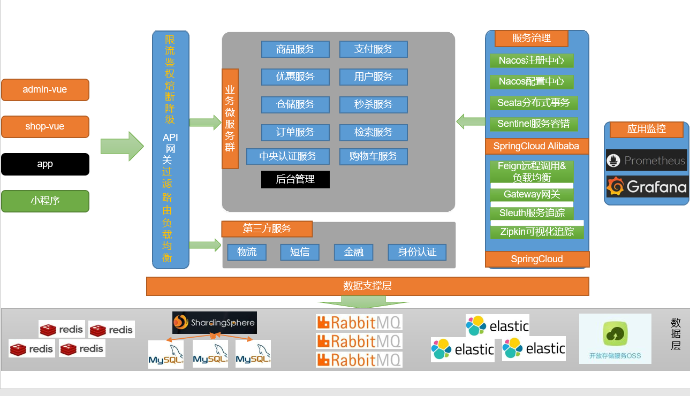
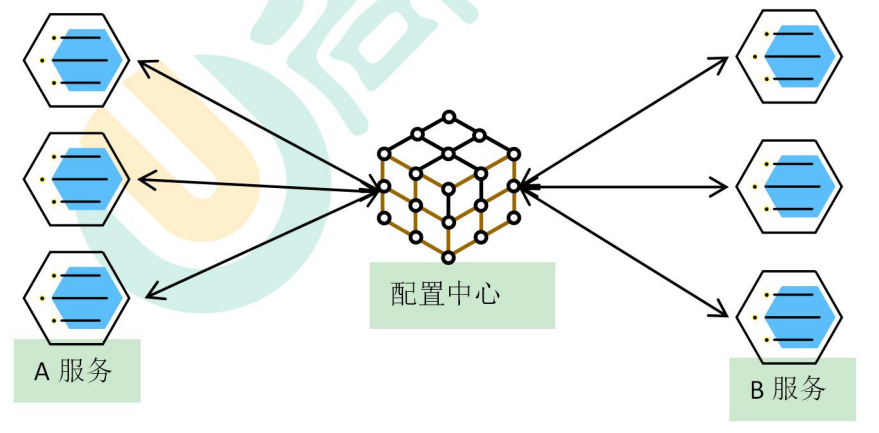

尚硅谷-谷粒商城

分布式基础&环境搭建 


## 一、项目简介

### 1、项目背景 


1）、电商模式 

市面上有 5 种常见的电商模式 B2B、B2C、C2B、C2C、O2O； 


1、B2B 模式 

B2B (Business to Business)， 是指商家与商家建立的商业关系。 如：阿里巴巴


2、B2C 模式 

B2C (Business to Consumer)， 就是我们经常看到的供应商直接把商品卖给用户，即“商对客” 模式，也就是通常说的商业零售，直接面向消费者销售产品和服务。如：苏宁易购、京东、天猫、小米商城 


3、C2B 模式 

C2B (Customer to Business)，即消费者对企业。先有消费者需求产生而后有企业生产，即先有消费者提出需求，后有生产企业按需求组织生产 


4、C2C 模式 

C2C (Customer to Consumer) ，客户之间自己把东西放上网去卖，如：淘宝，闲鱼


5、O2O 模式 

O2O 即 Online To Offline，也即将线下商务的机会与互联网结合在了一起，让互联网成为线下交易的前台。线上快速支付，线下优质服务。如：饿了么，美团，淘票票，京东到家


2）、谷粒商城 

谷粒商城是一个 B2C 模式的电商平台，销售自营商品给客户。 


### 2、项目架构图 

1)、项目微服务架构图 


2)、微服务划分图 




3)、项目技术&特色 

- 前后分离开发，并开发基于 vue 的后台管理系统 

- SpringCloud 全新的解决方案 

- 应用监控、限流、网关、熔断降级等分布式方案 全方位涉及 

- 透彻讲解分布式事务、分布式锁等分布式系统的难点 

- 分析高并发场景的编码方式，线程池，异步编排等使用 

- 压力测试与性能优化 

- 各种集群技术的区别以及使用 

- CI/CD 使用 

- ... 


4)、项目前置要求 学习项目的前置知识 

- 熟悉 SpringBoot 以及常见整合方案 

- 了解 SpringCloud 

- 熟悉 git，maven 

- 熟悉 linux，redis，docker 基本操作 

- 了解 html，css，js，vue 

- 熟练使用 idea 开发项目 


## 二、分布式基础概念


### 1、微服务 

微服务架构风格，就像是把一个**单独的应用程序**开发为**一套小服务**，每个**小服务**运行在自己的进程中，并使用轻量级机制通信，通常是 HTTP API。这些服务围绕业务能力来构建，并通过完全自动化部署机制来独立部署。这些服务使用不同的编程语言书写，以及不同数据存储技术，并保持最低限度的集中式管理。 

**简而言之：拒绝大型单体应用，基于业务边界进行服务微化拆分，各个服务独立部署运行。**


### 2、集群&分布式&节点 


集群是个物理形态，分布式是个工作方式。 

只要是一堆机器，就可以叫集群，他们是不是一起协作着干活，这个谁也不知道；


> 《分布式系统原理与范型》定义： 

> “分布式系统是若干独立计算机的集合，这些计算机对于用户来说就像单个相关系统”
>
> 分布式系统（distributed system）是建立在网络之上的软件系统。 


分布式是指将不同的业务分布在不同的地方。 

集群指的是将几台服务器集中在一起，实现同一业务。


 例如：**京东是一个分布式系统，众多业务运行在不同的机器**，所有业务构成一个大型的**业务集群**。每一个小的业务，比如用户系统，访问压力大的时候一台服务器是不够的。我们就应该将用户系统部署到多个服务器，也就是**每一个业务系统也可以做集群化**；


**分布式中的每一个节点，都可以做集群。 而集群并不一定就是分布式的。**

**节点：集群中的一个服务器** 


### 3、远程调用 

在分布式系统中，各个服务可能处于不同主机，但是服务之间不可避免的需要互相调用，我们称为远程调用。 

SpringCloud 中使用 HTTP+JSON 的方式完成远程调用 


### 4、负载均衡 


​	分布式系统中，A 服务需要调用 B 服务，B 服务在多台机器中都存在，A 调用任意一个服务器均可完成功能。 


​	为了使每一个服务器都不要太忙或者太闲，我们可以负载均衡的调用每一个服务器，提升网站的健壮性。 


**常见的负载均衡算法：** 

**轮询**：为第一个请求选择健康池中的第一个后端服务器，然后按顺序往后依次选择，直到最后一个，然后循环。 

**最小连接**：优先选择连接数最少，也就是压力最小的后端服务器，在会话较长的情况下可以考虑采取这种方式。 

**散列**：根据请求源的 IP 的散列（hash）来选择要转发的服务器。这种方式可以一定程度上保证特定用户能连接到相同的服务器。如果你的应用需要处理状态而要求用户能连接到 和之前相同的服务器，可以考虑采取这种方式。 


### 5、服务注册/发现&注册中心 

A 服务调用 B 服务，A 服务并不知道 B 服务当前在哪几台服务器有，哪些正常的，哪些服务已经下线。解决这个问题可以引入注册中心； 


如果某些服务下线，我们其他人可以实时的感知到其他服务的状态，从而避免调用不可用的服务 


### 6、配置中心 



每一个服务最终都有大量的配置，并且每个服务都可能部署在多台机器上。我们经常需要变更配置，我们可以让每个服务在配置中心获取自己的配置。 


**配置中心用来集中管理微服务的配置信息** 


### 7、服务熔断&服务降级 


在微服务架构中，微服务之间通过网络进行通信，存在相互依赖，当其中一个服务不可用时， 有可能会造成雪崩效应。要防止这样的情况，必须要有容错机制来保护服务。


1）、服务熔断 

​	a. 设置服务的超时，当被调用的服务经常失败到达某个阈值，我们可以开启断路保护机制，后来的请求不再去调用这个服务。本地直接返回默认的数据 


2）、服务降级 

​	a. 在运维期间，当系统处于高峰期，系统资源紧张，我们可以让非核心业务降级运行。降级：某些服务不处理，或者简单处理【抛异常、返回NULL、调用 Mock 数据、调用 Fallback 处理逻辑】。


### 8、API 网关 


在微服务架构中，**API Gateway** 作为整体架构的重要组件，它**抽象了微服务中都需要的公共功能**，同时提供了客户端**负载均衡，服务自动熔断，灰度发布，统一认证，限流流控，日志统计**等丰富的功能，帮助我们解决很多 API 管理难题。


##  三、环境搭建

### 1、安装 linux 虚拟机 

- 下载&安装 VirtualBox https://www.virtualbox.org/wiki/Downloads

直接下一步即可，可以自定义安装目录


要开启CPU 虚拟化 


- 下载&安装 Vagrant 

  - https://www.vagrantup.com/downloads Vagrant 下载

    直接下一步即可，可以自定义安装目录

  - https://app.vagrantup.com/boxes/search Vagrant 官方镜像仓库


- 打开 window cmd 窗口，运行 Vagrant init centos/7，即可初始化一个centos7 系统	

```shell
vagrant init centos/7	#初始化一个centos7环境
vagrant up		#启动虚拟机 系统root用户的密码是vagrant

vagrant reload #重启
```


- 运行 vagrant up 即可启动虚拟机。系统 root 用户的密码是vagrant 


- vagrant 其他常用命令 

  - vagrant ssh：自动使用 vagrant 用户连接虚拟机。 

  - vagrant upload source [destination] [name|id]：上传文件

  - https://www.vagrantup.com/docs/cli/init.html Vagrant 命令行

- 默认虚拟机的 ip 地址不是固定 ip，开发不方便 
  - 修改 Vagrantfile 


查看自己以太网适配器 VirtualBox Host-Only Network网段： 192.168.56.1

```shell
config.vm.network "private_network", ip: "192.168.56.10"
```

重新使用 vagrant up 启动机器即可。然后再 vagrant ssh 连接机器


- 默认只允许 ssh 登录方式，为了后来操作方便，文件上传等，我们可以配置允许账号密码登录 

```markdown
Vagrant ssh 进去系统之后 

vi /etc/ssh/sshd_config 
修改 PasswordAuthentication yes/no 
重启服务 service sshd restart 
```

- 以后可以使用提供的 ssh 连接工具直接连接 


注意：VirtualBox 会与包括但不限于如下软件冲突，需要卸载这些软件，然后重启电脑；冲突的软件：红蜘蛛，360，净网大师（有可能）等 


```markdown
修改 linux 的 yum 源 

1）、备份原 yum 源 
mv /etc/yum.repos.d/CentOS-Base.repo /etc/yum.repos.d/CentOS-Base.repo.backup 

2）、使用新 yum 源 
curl -o /etc/yum.repos.d/CentOS-Base.repohttp://mirrors.163.com/.help/CentOS7-Base-163.repo 

3）、生成缓存 yum makecache 
```


### 2、安装 docker 


Docker 安装文档：

https://docs.docker.com/engine/install/centos/


1、卸载系统之前的 

```shell
sudo yum remove docker \
                  docker-client \
                  docker-client-latest \
                  docker-common \
                  docker-latest \
                  docker-latest-logrotate \
                  docker-logrotate \
                  docker-engine
```


2、环境

```sh
sudo yum install -y yum-utils
```


仓库

```sh
sudo yum-config-manager \
    --add-repo \
    https://download.docker.com/linux/centos/docker-ce.repo
```


docker安装，一路y确认

```sh
sudo yum install docker-ce docker-ce-cli containerd.io docker-compose-plugin
```


3、启动  Start Docker.

```shell
sudo systemctl start docker
```


4、设置 docker 开机自启

```shell
[vagrant@localhost ~]$ sudo systemctl enable docker
Created symlink from /etc/systemd/system/multi-user.target.wants/docker.service to /usr/lib/systemd/system/docker.service.
```


5、测试 docker 常用命令，注意切换到 root 用户下 https://docs.docker.com/engine/reference/commandline/docker/ 

```
[vagrant@localhost ~]$ sudo systemctl start docker
[vagrant@localhost ~]$ docker -v
Docker version 20.10.14, build a224086
```


6、配置 docker 镜像加速 

阿里云，容器镜像服务 针对 Docker 客户端版本大于 1.10.0 的用户 您可以通过修改 daemon 配置文件/etc/docker/daemon.json 来使用加速器


- 容器镜像服务下面的镜像加速器

1. 安装／升级Docker客户端

推荐安装1.10.0以上版本的Docker客户端，参考文档[docker-ce](https://yq.aliyun.com/articles/110806)

2. 配置镜像加速器

针对Docker客户端版本大于 1.10.0 的用户

您可以通过修改daemon配置文件/etc/docker/daemon.json来使用加速器

```shell
sudo mkdir -p /etc/docker
sudo tee /etc/docker/daemon.json <<-'EOF'
{
  "registry-mirrors": ["https://v4blz6az.mirror.aliyuncs.com"]
}
EOF
sudo systemctl daemon-reload
sudo systemctl restart docker
```


https://hub.docker.com/


### 3、docker 安装 mysql 


1、下载镜像文件 docker pull mysql:5.7 

```shell
sudo docker pull mysql:5.7
```


2、创建实例并启动 

```
docker run -p 3306:3306 --name mysql \
-v /mydata/mysql/log:/var/log/mysql \
-v /mydata/mysql/data:/var/lib/mysql \
-v /mydata/mysql/conf:/etc/mysql \
-e MYSQL_ROOT_PASSWORD=root \
-d mysql:5.7
```


```
参数说明
p3306:3306:将容器的3306端口映射到主机的3306端口
-v/mydata/mysql/conf:/etc/mysql:将配置文件夹挂载到主机
-v/mydata/mysql/log:/var/log/mysql:将日志文件夹挂载到主机
-v/mydata/mysql/data:/var/lib/mysql:将配置文件夹挂载到主机
-e MYSQL_ROOT_PASSWORD=root:初始化root用户的密码
```


MySQL 配置 

进入/mydata/mysql/conf修改mysql配置：

新建my.cnf

```shell
[client]
default-character-set=utf8

[mysql]
default-character-set=utf8

[mysqld]
init_connect='SET collation_connection utf8_unicode_ci'
init_connect='SET NAMES utf8'
character-set-server=utf8
collation-server=utf8_unicode_ci
skip-character-set-client-handshake
skip-name-resolve
```


**注意**：解决 MySQL 连接慢的问题 

在配置文件中加入如下，并重启 mysql 

[mysqld] skip-name-resolve 

解释： skip-name-resolve：跳过域名解析 


3、通过容器的 mysql 命令行工具连接

```shell
docker exec -it mysql mysql -uroot -proot 
```


4、设置 root 远程访问 

```sql
grant all privileges on *.* to 'root'@'%' identified by 'root' with grant option; 

flush privileges; 
```


5、进入容器文件系统 

```shell
docker exec -it mysql /bin/bash
```


### 4、docker 安装 redis 


1、下载镜像文件 

```shell
docker pull redis 
```


2、创建实例并启动 

```shell
mkdir -p /mydata/redis/conf

touch /mydata/redis/conf/redis.conf


docker run -p 6379:6379 --name redis -v/mydata/redis/data:/data \
-v /mydata/redis/conf/redis.conf:/etc/redis/redis.conf \
-d redis redis-server /etc/redis/redis.conf
```


redis 自描述文件： https://raw.githubusercontent.com/antirez/redis/4.0/redis.conf 


3、使用 redis 镜像执行 redis-cli 命令连接

```shell
docker exec -it redis redis-cli 
```


4、默认不能持久化，重启数据会丢失

开启aof，保存在硬盘设置

```sh
appendonly yes
```


### 5、开发环境统一 


#### 1、Maven 


配置阿里云镜像   

```xml
<mirror>
    <id>alimaven</id>
    <name>aliyun maven</name>
    <url>http://maven.aliyun.com/nexus/content/groups/public/</url>
    <mirrorOf>central</mirrorOf>        
</mirror>
```


配置 jdk1.8 编译项目

```xml
<profile>
    <id>jdk-1.8</id>
    <activation>
        <activeByDefault>true</activeByDefault>
        <jdk>1.8</jdk>
    </activation>
    <properties>
        <maven.compiler.source>1.8</maven.compiler.source>
        <maven.compiler.target>1.8</maven.compiler.target>
        <maven.compiler.compilerVersion>1.8</maven.compiler.compilerVersion>
    </properties>
</profile>
```


#### 2、Idea&VsCode

 ```markdown
idea 安装 lombok、mybatisx 插件 
 ```


Vscode 安装开发必备插件 

```markdown
Vetur —— 语法高亮、智能感知、Emmet 等 
包含格式化功能， Alt+Shift+F （格式化全文），Ctrl+K Ctrl+F（格式化选中代码，两个Ctrl 需要同时按着） 

EsLint —— 语法纠错 

Auto Close Tag —— 自动闭合 HTML/XML 标签 

Auto Rename Tag —— 自动完成另一侧标签的同步修改 

JavaScript(ES6) code snippets — — ES6 语 法 智 能 提 示 以 及 快 速输入，除js 外还支持.ts，.jsx，.tsx，.html，.vue，省去了配置其支持各种包含 js 代码文件的时间

HTML CSS Support —— 让 html 标签上写 class 智能提示当前项目所支持的样式

HTML Snippets —— html 快速自动补全 

Open in browser —— 浏览器快速打开 

Live Server —— 以内嵌服务器方式打开 

Chinese (Simplified) Language Pack for Visual Studio Code —— 中文语言包
```


#### 3、安装配置 git 


1、下载 git；https://git-scm.com 


2、配置 git，进入 git bash 

```shell
#配置用户名 
git config --global user.name "username" //（名字） 

# 配置邮箱 
git config --global user.email "username@email.com" //(注册账号时用的邮箱) 
```


3、配置 ssh 免密登录

 https://gitee.com/help/articles/4181#article-header0 


```markdown
进入 git bash；

使用：ssh-keygen -t rsa -C "xxxxx@xxxxx.com"命令。 

连续三次回车。一般用户目录下会有 

或者 cat ~/.ssh/id_rsa.pub 

登录进入 gitee，
在设置里面找到 SSH KEY 将.pub 文件的内容粘贴进去


使用 ssh -T git@gitee.com 测试是否成功即可 
Git+码云教程 https://gitee.com/help/articles/4104 
```


#### 4、逆向工程使用 

1、导入项目逆向工程 


2、下载人人开源后台管理系统脚手架工程 

(1) 导入工程，创建数据库 

(2) 修改工程 shiro 依赖为 SpringSecurity 

(3) 删除部分暂时不需要的业务 


3、下载人人开源后台管理系统 vue 端脚手架工程 

(1) vscode 导入前端项目 

(2) 前后端联调测试基本功能 


### 6、创建项目微服务 


商品服务、仓储服务、订单服务、优惠券服务、用户服务 


共同： 

1）、web、openfeign 

2）、每一个服务，包名 com.atguigu.gulimall.xxx(product/order/ware/coupon/member) 

3）、模块名：gulimall-coupon 

1）、从 gitee 初始化一个项目


2）、创建各个微服务项目


 1）、了解人人开源项目，快速搭建后台脚手架 

2）、修改代码调整为我们的业务逻辑 

3）、创建各个微服务以及数据库