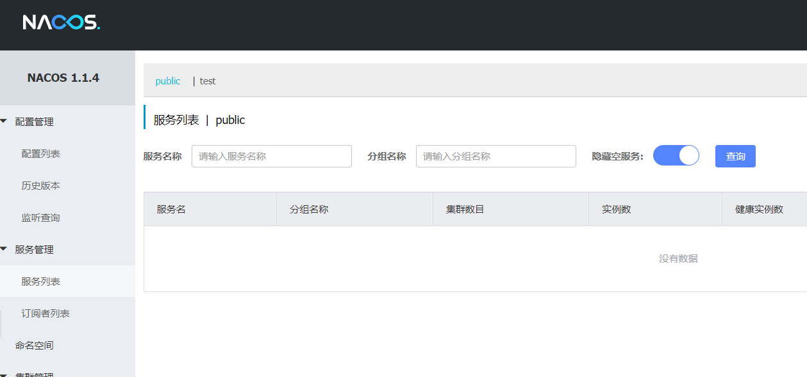
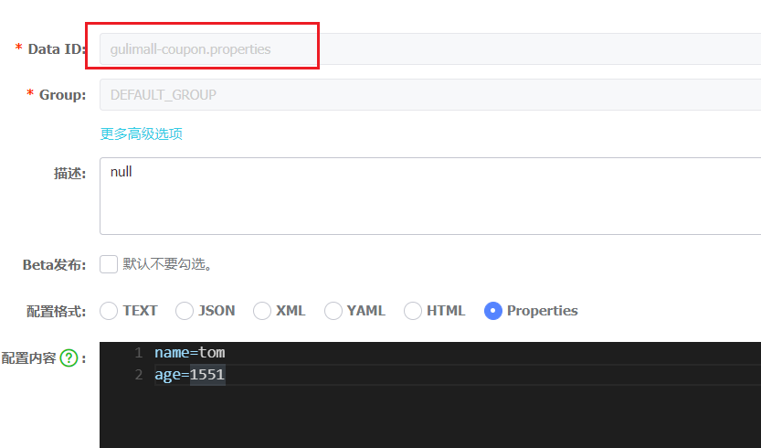
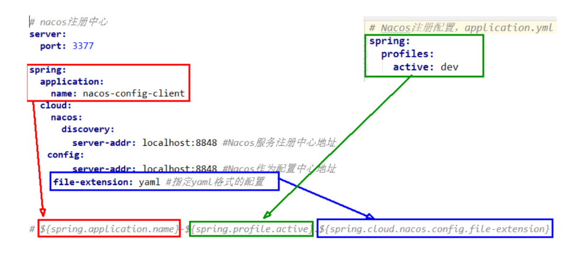
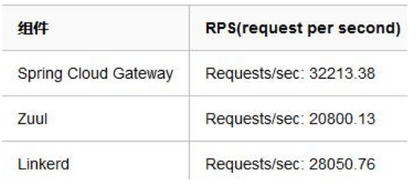
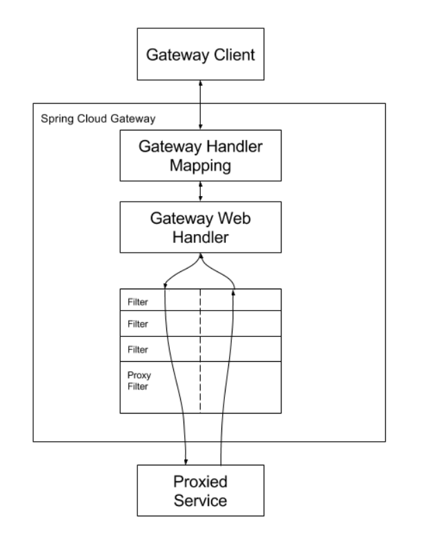
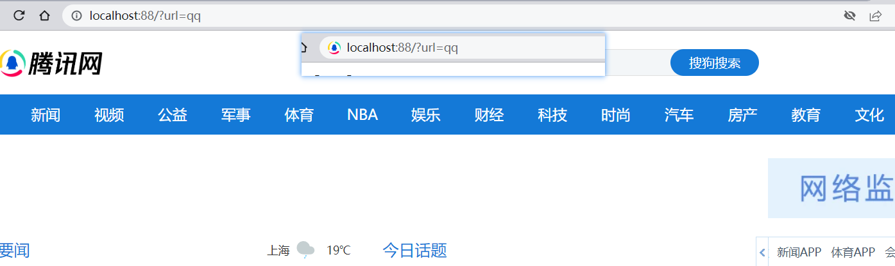
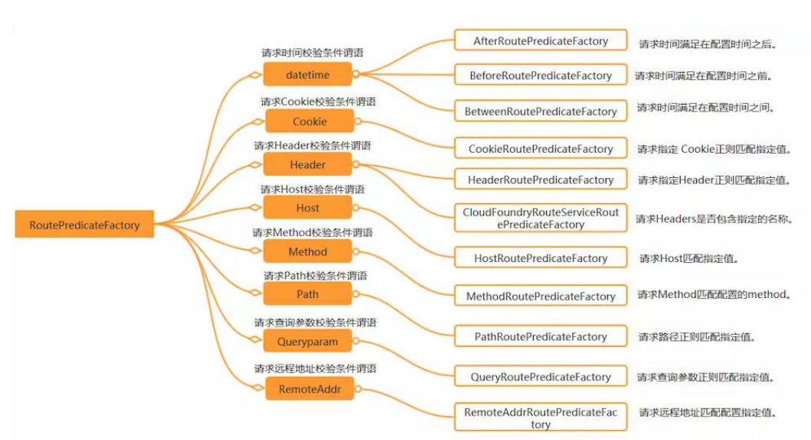
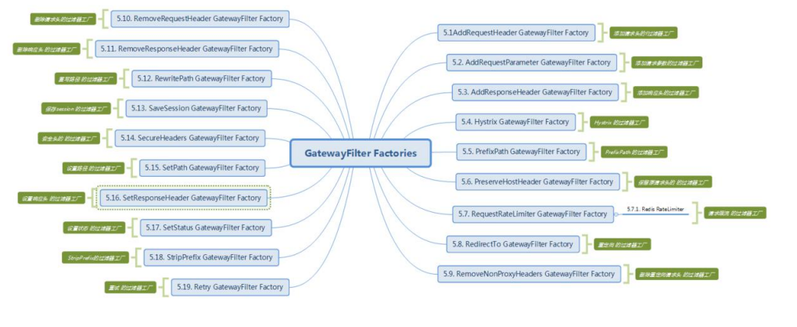
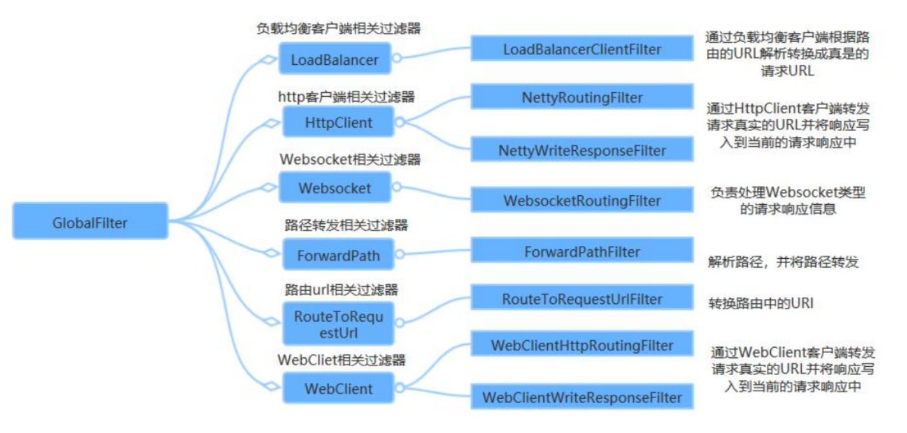

谷粒商城


SpringCloud 组件 


## 一、SpringCloud Alibaba 


### 1、SpringCloud Alibaba 简介


1）、简介 

Spring Cloud Alibaba 致力于提供**微服务开发**的**一站式解决方案**。此项目包含开发分布式应用微服务的必需组件，方便开发者通过 Spring Cloud 编程模型轻松使用这些组件来开发分布式应用服务。 


依托 Spring Cloud Alibaba，您只需要添加一些注解和少量配置，就可以将Spring Cloud 应用接入阿里微服务解决方案，通过阿里中间件来迅速搭建分布式应用系统。


https://github.com/alibaba/spring-cloud-alibaba 


2）、为什么使用 


**SpringCloud 的几大痛点** 

SpringCloud 部分组件停止维护和更新，给开发带来不便； 

SpringCloud 部分环境搭建复杂，没有完善的可视化界面，我们需要大量的二次开发和定制SpringCloud 配置复杂，难以上手，部分配置差别难以区分和合理应用


**SpringCloud Alibaba 的优势：**

 阿里使用过的组件经历了考验，性能强悍，设计合理，现在开源出来大家用成套的产品搭配完善的可视化界面给开发运维带来极大的便利 搭建简单，学习曲线低。 


**结合 SpringCloud Alibaba 我们最终的技术搭配方案：** 

SpringCloud Alibaba - Nacos：注册中心（服务发现/注册） 

SpringCloud Alibaba - Nacos：配置中心（动态配置管理） 

SpringCloud - Ribbon：负载均衡 

SpringCloud - Feign：声明式 HTTP 客户端（调用远程服务）

 SpringCloud Alibaba - Sentinel：服务容错（限流、降级、熔断） 

SpringCloud - Gateway：API 网关（webflux 编程模式） 

SpringCloud - Sleuth：调用链监控 

SpringCloud Alibaba - Seata：原 Fescar，即分布式事务解决方案 


3）、版本选择 

由于 Spring Boot 1 和 Spring Boot 2 在 Actuator 模块的接口和注解有很大的变更，且spring-cloud-commons 从 1.x.x 版本升级到 2.0.0 版本也有较大的变更，因此我们采取跟SpringBoot 版本号一致的版本: 

- 1.5.x 版本适用于 Spring Boot 1.5.x 

- 2.0.x 版本适用于 Spring Boot 2.0.x 

- 2.1.x 版本适用于 Spring Boot 2.1.x 


4）、项目中的依赖 

在 common 项目中引入如下。进行统一管理  

```xml
<dependencyManagement>
    <dependencies>
        <!--spring cloud Hoxton.SR1-->
        <dependency>
            <groupId>org.springframework.cloud</groupId>
            <artifactId>spring-cloud-dependencies</artifactId>
            <version>Hoxton.SR1</version>
            <type>pom</type>
            <scope>import</scope>
        </dependency>
        <!--spring cloud alibaba 2.1.0.RELEASE-->
        <dependency>
            <groupId>com.alibaba.cloud</groupId>
            <artifactId>spring-cloud-alibaba-dependencies</artifactId>
            <version>2.1.0.RELEASE</version>
            <type>pom</type>
            <scope>import</scope>
        </dependency>
    </dependencies>
</dependencyManagement>
```


### 2、SpringCloud Alibaba-Nacos[作为注册中心] 

Nacos 是阿里巴巴开源的一个更易于构建云原生应用的动态服务发现、配置管理和服务管理平台。他是使用 java 编写。需要依赖 java 环境 

Nacos 文档地址： https://nacos.io/zh-cn/docs/quick-start.html 


1）、下载 nacos-server https://github.com/alibaba/nacos/releases 


2）、启动 nacos-server 

- 双击 bin 中的 startup.cmd 文件 

- 访问 http://localhost:8848/nacos/ 

- 使用默认的 nacos/nacos 进行登录 




3）、将微服务注册到 nacos 中

1、首先，修改 pom.xml 文件，引入 Nacos Discovery Starter。

```xml
<!--        服务注册/发现-->
<dependency>
    <groupId>com.alibaba.cloud</groupId>
    <artifactId>spring-cloud-starter-alibaba-nacos-discovery</artifactId>
</dependency>
```


2、在应用的 /src/main/resources/application.properties配置文件中配置 Nacos Server 地址 

```properties
spring.cloud.nacos.config.server-addr=127.0.0.1:8848
```


3、使用@EnableDiscoveryClient 开启服务注册发现功能

```java
@EnableDiscoveryClient
@SpringBootApplication
public class GulimallCouponApplication {

    public static void main(String[] args) {
        SpringApplication.run(GulimallCouponApplication.class, args);
    }

}
```


4、启动应用，观察 nacos 服务列表是否已经注册上服务

注意：每一个应用都应该有名字，这样才能注册上去。修改 application.properties 文件

```yaml
server:
  port: 7000
spring:
  application:
    name: gulimall-coupon
```


5、注册更多的服务上去，测试使用 feign 远程调用Nacos 


使用三步 

```markdown
1、导包 nacos-discovery 
2、写配置，指定 nacos 地址，指定应用的名字 
3、开启服务注册发现功能@EnableDiscoveryClient Feign 使用三步 
```


```java
//1、导包 openfeign 

//2、开启@EnableFeignClients 功能 
@SpringBootApplication
@EnableFeignClients(basePackages = "com.gulimall.member.feign")
public class GulimallMemberApplication {

    public static void main(String[] args) {
        SpringApplication.run(GulimallMemberApplication.class, args);
    }

}

//3、编写接口，进行远程调用 @FeignClient("stores") 
@FeignClient("gulimall-coupon")
public interface CouponFeignService {
    @RequestMapping("/coupon/coupon/member/list")
    public R memberList();
}

```


6、更多配置 

https://github.com/alibaba/spring-cloud-alibaba/blob/master/spring-cloud-alibaba-examples/nacos-example/nacos-discovery-example/readme-zh.md#more 


### 3、SpringCloud Alibaba-Nacos[作为配置中心] 


#### 1、pom.xml 引入 Nacos Config Starter。 

```xml
<!--        配置中心来做配置管理-->
<dependency>
    <groupId>com.alibaba.cloud</groupId>
    <artifactId>spring-cloud-starter-alibaba-nacos-config</artifactId>
</dependency>
```


#### 2、在应用的 /src/main/resources/bootstrap.properties配置文件中配置 Nacos Config 元数据

```properties
spring.application.name=gulimall-coupon
spring.cloud.nacos.config.server-addr=127.0.0.1:8848

#主要配置应用名和配置中心地址 
```


#### 3、在 nacos 中添加配置 

在 nacos 中创建一个 **应用名.properties** 配置文件并编写配置 

```markdown
Nacos Config 数据结构 

Nacos Config 主要通过 dataId 和 group 来唯一确定一条配置。 

Nacos Client 从 Nacos Server 端获取数据时，调用的是此接口 ConfigService.getConfig(String dataId, String group, long timeoutMs)。 

```


Spring Cloud 应用获取数据 

**dataID：** 

在 Nacos Config Starter 中，dataId 的拼接格式如下 

- ${prefix} - ${spring.profiles.active} . ${file-extension} 

prefix 默认为spring.application.name的值，也可以通过配置项 spring.cloud.nacos.config.prefix 来配置。


- spring.profiles.active 即为当前环境对应的 profile 

注意，当 activeprofile 为空时，对应的连接符 - 也将不存在，dataId 的拼接格式变成${prefix}.${file-extension} 

file-extension 为配置内容的数据格式，可以通过配置项 spring.cloud.nacos.config.file-extension 来配置。 目前只支持 properties 类型。


**Group：** 

Group 默认为 DEFAULT_GROUP，可以通过 spring.cloud.nacos.config.group 配置。


#### 4、在应用中使用@Value 和@RefreshScope 


完成上述两步后，应用会从 Nacos Config 中获取相应的配置，并添加在Spring Environment 的 PropertySources 中 。 这 里 我 们 使 用 @Value 注 解 来 将对应的配置注入到CouponController的 userName 和 age 字段，并添加 @RefreshScope 打开**动态刷新功能**

```java
@RefreshScope
@RestController
@RequestMapping("coupon/coupon")
public class CouponController {

    @Value("${name}")
    private String name;

    @Value("${age}")
    private Integer age;

    @RequestMapping("/user")
    public R user(){
        return R.ok().put("name",name).put("age",age);
    }
}
```


不指定DateId时默认文件名




####  5、进阶 


##### （1）、核心概念 

```markdown
命名空间： 

用于进行租户粒度的配置隔离。不同的命名空间下，可以存在相同的Group 或Data ID的配置。Namespace 的常用场景之一是不同环境的配置的区分隔离，例如开发测试环境和生产环境的资源（如配置、服务）隔离等。 

配置集： 
一组相关或者不相关的配置项的集合称为配置集。在系统中，一个配置文件通常就是一个配置集，包含了系统各个方面的配置。例如，一个配置集可能包含了数据源、线程池、日志级别等配置项。 

配置集 ID： 
Nacos 中的某个配置集的 ID。配置集 ID 是组织划分配置的维度之一。Data ID 通常用于组织划分系统的配置集。一个系统或者应用可以包含多个配置集，每个配置集都可以被一个有意义的名称标识。Data ID 通常采用类 Java 包（如 com.taobao.tc.refund.log.level）的命名规则保证全局唯一性。此命名规则非强制。 

配置分组： 
Nacos 中的一组配置集，是组织配置的维度之一。通过一个有意义的字符串（如Buy 或Trade ）对配置集进行分组，从而区分 Data ID 相同的配置集。当您在Nacos 上创建一个配置时，如果未填写配置分组的名称，则配置分组的名称默认采用 DEFAULT_GROUP 。配置分组的常见场景：不同的应用或组件使用了相同的配置类型，如database_url 配置和MQ_topic 配置。 
```


##### （2）、原理 

```markdown
自动注入： 
NacosConfigStarter 实现了 org.springframework.cloud.bootstrap.config.PropertySourceLocator 接口，并将优先级设置成了最高。

在 Spring Cloud 应用启动阶段，会主动从 Nacos Server 端获取对应的数据，并将获取到的数据转换成 PropertySource 且注入到 Environment 的 PropertySources 属性中，所以使用@Value 注解也能直接获取 Nacos Server 端配置的内容。 

动态刷新： 
Nacos Config Starter 默认为所有获取数据成功的 Nacos 的配置项添加了监听功能，在监听到服务端配置发生变化时会实时触发 

org.springframework.cloud.context.refresh.ContextRefresher 的 refresh 方法。如果需要对 Bean 进行动态刷新，请参照 Spring 和 Spring Cloud 规范。
推荐给类添加@RefreshScope 或@ConfigurationProperties 注解， 

```


单配置文件

```properties
spring.cloud.nacos.config.namespace=2f2ae2f0-e32b-458d-b0a4-9af84b6b3caf
spring.cloud.nacos.config.group=dev
#spring.cloud.nacos.config.file-extension=yml
```




##### （3）、加载多配置文件 

```properties
spring.application.name=gulimall-coupon
spring.cloud.nacos.config.server-addr=127.0.0.1:8848

#spring.cloud.nacos.config.namespace=2f2ae2f0-e32b-458d-b0a4-9af84b6b3caf
#spring.cloud.nacos.config.group=dev
#spring.cloud.nacos.config.file-extension=yml


spring.cloud.nacos.config.namespace=2f2ae2f0-e32b-458d-b0a4-9af84b6b3caf
spring.cloud.nacos.config.ext-config[0].data-id=datasource.yml
#开启动态刷新
spring.cloud.nacos.config.ext-config[0].refresh=true
spring.cloud.nacos.config.ext-config[0].group=dev

spring.cloud.nacos.config.ext-config[1].data-id=mybatis.yml
spring.cloud.nacos.config.ext-config[1].refresh=true
spring.cloud.nacos.config.ext-config[1].group=dev

spring.cloud.nacos.config.ext-config[2].data-id=other.yml
spring.cloud.nacos.config.ext-config[2].refresh=true
spring.cloud.nacos.config.ext-config[2].group=dev
```


##### （4）、namespace 与 group 最佳实践 

每个微服务创建自己的 namespace 进行隔离，group 来区分 dev，beta，prod 等环境


4、SpringCloud Alibaba-Sentinel 


1、简介 官方文档：https://github.com/alibaba/Sentinel/wiki/%E4%BB%8B%E7%BB%8D 

项目地址：https://github.com/alibaba/Sentinel 


随着微服务的流行，服务和服务之间的稳定性变得越来越重要。Sentinel 以流量为切入点，从流量控制、熔断降级、系统负载保护等多个维度保护服务的稳定性。

Sentinel 具有以下特征: 丰富的应用场景：Sentinel 承接了阿里巴巴近 10 年的双十一大促流量的核心场景，例如秒杀（即突发流量控制在系统容量可以承受的范围）、消息削峰填谷、集群流量控制、实时熔断下游不可用应用等。 完备的实时监控：Sentinel 同时提供实时的监控功能。您可以在控制台中看到接入应用的单台机器秒级数据，甚至 500 台以下规模的集群的汇总运行情况。

广泛的开源生态：Sentinel 提供开箱即用的与其它开源框架/库的整合模块，例如与 Spring Cloud、Dubbo、gRPC 的整合。您只需要引入相应的依赖并进行简单的配置即可快速地接入 Sentinel。 完善的 SPI 扩展点：Sentinel 提供简单易用、完善的 SPI 扩展接口。您可以通过实现扩展接口来快速地定制逻辑。例如定制规则管理、适配动态数据源等。

Sentinel 分为两个部分: 

 核心库（Java 客户端）不依赖任何框架/库，能够运行于所有 Java 运行时环境，同时 对 Dubbo / Spring Cloud 等框架也有较好的支持。 

 控制台（Dashboard）基于 Spring Boot 开发，打包后可以直接运行，不需要额外的Tomcat 等应用容器。 Sentinel 基本概念 

 资源 资源是 Sentinel 的关键概念。它可以是 Java 应用程序中的任何内容，例如，由应用程序提供的服务，或由应用程序调用的其它应用提供的服务，甚至可以是一段代码。在接下来的文档中，我们都会用资源来描述代码块。 只要通过 Sentinel API 定义的代码，就是资源，能够被 Sentinel 保护起来。大部分情况下，可以使用方法签名，URL，甚至服务名称作为资源名来标示资源。

  规则 围绕资源的实时状态设定的规则，可以包括流量控制规则、熔断降级规则以及系统保护规则。所有规则可以动态实时调整。 


2、Hystrix 与 Sentinel 比较 


3、整合 Feign+Sentinel 测试熔断降级https://github.com/alibaba/Sentinel/wiki/%E4%B8%BB%E9%A1%B5 什么是熔断降级 除了流量控制以外，降低调用链路中的不稳定资源也是 Sentinel 的使命之一。由于调用关 系的复杂性，如果调用链路中的某个资源出现了不稳定，最终会导致请求发生堆积。Sentinel 和 Hystrix 的原则是一致的: 当检测到调用链路中某个资源出现不稳定的表现，例如请求响应时间长或异常比例升高的时候，则对这个资源的调用进行限制，让请求快速失败，避免影响到其它的资源而导致级联故障。 熔断降级设计理念 在限制的手段上，Sentinel 和 Hystrix 采取了完全不一样的方法。 Hystrix 通过 线程池隔离 的方式，来对依赖（在 Sentinel 的概念中对应资源）进行了隔离。这样做的好处是资源和资源之间做到了最彻底的隔离。缺点是除了增加了线程切换的成本（过多的线程池导致线程数目过多），还需要预先给各个资源做线程池大小的分配。


Sentinel 对这个问题采取了两种手段: 

 通过并发线程数进行限制 和资源池隔离的方法不同，Sentinel 通过限制资源并发线程的数量，来减少不稳定资源对其它资源的影响。这样不但没有线程切换的损耗，也不需要您预先分配线程池的大小。当某个资源出现不稳定的情况下，例如响应时间变长，对资源的直接影响就是会造成线程数的逐步堆积。当线程数在特定资源上堆积到一定的数量之后，对该资源的新请求就会被拒绝。堆积的线程完成任务后才开始继续接收请求。 

 通过响应时间对资源进行降级 除了对并发线程数进行控制以外，Sentinel 还可以通过响应时间来快速降级不稳定的资源。当依赖的资源出现响应时间过长后，所有对该资源的访问都会被直接拒绝，直到过了指定的时间窗口之后才重新恢复。 


整合测试： https://github.com/alibaba/spring-cloud-alibaba/blob/master/spring-cloud-alibaba-examples/sentinel-example/sentinel-feign-example/readme-zh.md 


1、引入依赖 org.springframework.cloud spring-cloud-starter-openfeign  com.alibaba.cloud spring-cloud-starter-alibaba-sentinel 


2、使用 Nacos 注册中心 com.alibaba.cloud spring-cloud-starter-alibaba-nacos-discovery 


3、定义 fallback 实现 在服务消费者中，实现 feign 远程接口，接口的实现方法即为调用错误的容错方法public class OrderFeignServiceFallBack implements OrderFeignService { @Override public Resp getOrderInfo(String orderSn) { return null; } } 


4、定义 fallbackfactory 并放在容器中 @Component public class OrderFeignFallbackFactory implements FallbackFactory { @Override public OrderFeignServiceFallBack create(Throwable throwable) { return new OrderFeignServiceFallBack(throwable); } } 


5、改造 fallback 类接受异常并实现容错方法 public class OrderFeignServiceFallBack implements OrderFeignService {private Throwable throwable; public OrderFeignServiceFallBack(Throwable throwable){ this.throwable = throwable; } @Override public Resp getOrderInfo(String orderSn) { return Resp.fail(new OrderVo()); } } 


6、远程接口配置 feign 客户端容错 @FeignClient(value = "gulimall-oms",fallbackFactory = OrderFeignFallbackFactory.class) public interface OrderFeignService { @GetMapping("/oms/order/bysn/{orderSn}") public Resp getOrderInfo(@PathVariable("orderSn") String orderSn); } 


7、开启 sentinel 代理 feign 功能；在 application.properties 中配置 feign.sentinel.enabled=true 测试熔断效果。当远程服务出现问题，会自动调用回调方法返回默认数据，并且更快的容错方式 


1、使用@SentinelResource，并定义 fallback @SentinelResource(value = "order",fallback = "e") Fallback 和原方法签名一致，但是最多多一个 Throwable 类型的变量接受异常。https://github.com/alibaba/Sentinel/wiki/%E6%B3%A8%E8%A7%A3%E6%94%AF%E6%8C%81 需要给容器中配置注解切面 @Bean public SentinelResourceAspect sentinelResourceAspect() { return new SentinelResourceAspect(); } 在控制台添加降级策略 


2、测试降级效果 当远程服务停止，前几个服务会尝试调用远程服务，满足降级策略条件以后则不会再尝试调用远程服务 


4、整合 Sentinel 测试限流（流量控制）https://github.com/alibaba/spring-cloud-alibaba/blob/master/spring-cloud-alibaba-examples/sentinel-example/sentinel-core-example/readme-zh.md 什么是流量控制 流量控制在网络传输中是一个常用的概念，它用于调整网络包的发送数据。然而，从系统稳定性角度考虑，在处理请求的速度上，也有非常多的讲究。任意时间到来的请求往往是随机不可控的，而系统的处理能力是有限的。我们需要根据系统的处理能力对流量进行控制。


Sentinel 作为一个调配器，可以根据需要把随机的请求调整成合适的形状，如下图所示：流量控制设计理念 流量控制有以下几个角度: 


 资源的调用关系，例如资源的调用链路，资源和资源之间的关系；

 运行指标，例如 QPS、线程池、系统负载等；

  控制的效果，例如直接限流、冷启动、排队等。 Sentinel 的设计理念是让您自由选择控制的角度，并进行灵活组合，从而达到想要的效果。


1、引入 Sentinel starter com.alibaba.cloud spring-cloud-starter-alibaba-sentinel 

2、接入限流埋点

  HTTP 埋点 Sentinel starter 默认为所有的 HTTP 服务提供了限流埋点，如果只想对HTTP 服务进行限流，那么只需要引入依赖，无需修改代码。

  自定义埋点 如果需要对某个特定的方法进行限流或降级，可以通过 @SentinelResource 注解来完成限流的埋点，示例代码如下： @SentinelResource("resource") public String hello() { return "Hello"; } 当 然 也 可 以 通 过 原 始 的 SphU.entry(xxx) 方 法 进 行 埋 点 ， 可 以参见Sentinel 文档（ https://github.com/alibaba/Sentinel/wiki/%E5%A6%82%E4%BD%95%E4%BD%BF%E7%94%A8#%E5%AE%9A%E4%B9%89%E8%B5%84%E6%BA%90）。


 3、配置限流规则 Sentinel 提供了两种配置限流规则的方式：代码配置 和 控制台配置。


 通过代码来实现限流规则的配置。一个简单的限流规则配置示例代码如下，更多限流规则配置详情请参考 Sentinel 文档。 （ https://github.com/alibaba/Sentinel/wiki/%E5%A6%82%E4%BD%95%E4%BD%BF%E7%94%A8#%E5%AE%9A%E4%B9%89%E8%A7%84%E5%88%99） List rules = new ArrayList(); FlowRule rule = new FlowRule(); rule.setResource(str); // set limit qps to 10 rule.setCount(10); rule.setGrade(RuleConstant.FLOW_GRADE_QPS); rule.setLimitApp("default"); rules.add(rule); FlowRuleManager.loadRules(rules); 


 通过控制台进行限流规则配置 


1、下载控制台： http://edas-public.oss-cn-hangzhou.aliyuncs.com/install_package/demo/sentinel-dashboard.jar 


2、启动控制台，执行 Java 命令 java -jar sentinel-dashboard.jar 完成Sentinel 控制台的启动。 控制台默认的监听端口为 8080。


 4、启动应用并配置 增加配置，在应用的 /src/main/resources/application.properties 中添加基本配置信息spring.application.name=sentinel-example server.port=18083 spring.cloud.sentinel.transport.dashboard=localhost:8080 5、控制台配置限流规则并验证 访问 http://localhost:8080 页面。 如果您在控制台没有找到应用，请调用一下进行了 Sentinel 埋点的URL 或方法，因为Sentinel 使用了 lazy load 策略。 任意发送请求，可以在簇点链路里面看到刚才的请求，可以对请求进行流控； 测试流控效果 


6、自定义流控响应 


7、持久化流控规则 默认的流控规则是保存在项目的内存中，项目停止再启动，流控规则就是失效。我们可以持久化保存规则； https://github.com/alibaba/Sentinel/wiki/%E5%8A%A8%E6%80%81%E8%A7%84%E5%88%99%E6%89%A9%E5%B1%95#datasource-%E6%89%A9%E5%B1%95 生产环境使用模式： 我 们 推 荐 通 过 控 制 台 设 置 规 则 后 将 规 则 推 送 到 统 一 的 规 则中心，客户端实现ReadableDataSource 接口端监听规则中心实时获取变更， 解决方案： DataSource 扩展常见的实现方式有: 


 拉模式：客户端主动向某个规则管理中心定期轮询拉取规则，这个规则中心可以是RDBMS、文件，甚至是 VCS 等。这样做的方式是简单，缺点是无法及时获取变更；


 推模式：规则中心统一推送，客户端通过注册监听器的方式时刻监听变化，比如使用Nacos、Zookeeper 等配置中心。这种方式有更好的实时性和一致性保证。推模式：使用 Nacos 配置规则


 1、引入依赖 com.alibaba.csp sentinel-datasource-nacos 

1.6.3 2、编写配置类， https://github.com/alibaba/Sentinel/wiki/%E5%8A%A8%E6%80%81%E8%A7%84%E5%88%99%E6%89%A9%E5%B1%95#%E6%8E%A8%E6%A8%A1%E5%BC%8F%E4%BD%BF%E7%94%A8-nacos- %E9%85%8D%E7%BD%AE%E8%A7%84%E5%88%99 @Configuration public class SentinelConfig { public SentinelConfig(){ //1、加载流控策略 ReadableDataSource> flowRuleDataSource = newNacosDataSource<>("127.0.0.1:8848", "demo", "sentinel", source -> JSON.parseObject(source, new TypeReference>() {})); FlowRuleManager.register2Property(flowRuleDataSource.getProperty()); //2、加载降级策略 ReadableDataSource> degradeRuleDataSource=new NacosDataSource<>("127.0.0.1:8848", "demo", "sentinel", source -> JSON.parseObject(source, new TypeReference>() {})); DegradeRuleManager.register2Property(degradeRuleDataSource.getProperty());//3、加载系统规则 ReadableDataSource> systemRuleDataSource =new NacosDataSource<>("127.0.0.1:8848", "demo", "sentinel", source -> JSON.parseObject(source, new TypeReference>() {})); SystemRuleManager.register2Property(systemRuleDataSource.getProperty()); //4、加载权限策略 ReadableDataSource> authorityRuleDataSource = new NacosDataSource<>("127.0.0.1:8848", "demo","sentinel", source -> JSON.parseObject(source, new TypeReference>() {})); AuthorityRuleManager.register2Property(authorityRuleDataSource.getProperty()); } } 参照 https://github.com/alibaba/Sentinel/wiki/Dynamic-Rule-Configuration 查看更多控制规则3、在 nacos 中创建 dataId，并使用 json 格式


 4、添加一条流控规则测试 [ { "resource": "/ums/member/list", "limitApp": "default", "grade": 1, "count": 5, "strategy": 0, "controlBehavior": 0, "clusterMode": false } ] 配置含义说明： https://github.com/alibaba/Sentinel/wiki/%E6%B5%81%E9%87%8F%E6%8E%A7%E5%88%B6 resource：资源名，即限流规则的作用对象 count: 限流阈值 grade: 限流阈值类型（QPS 或并发线程数） limitApp: 流控针对的调用来源，若为 default 则不区分调用来源 strategy: 调用关系限流策略 controlBehavior: 流量控制效果（直接拒绝、Warm Up、匀速排队） 5、系统规则，降级规则等均可添加 [ { "resource": "/ums/member/list", "limitApp": "default", "grade": 1, "count": 5, "strategy": 0, "controlBehavior": 0, "clusterMode": false },{ "highestSystemLoad": -1, "highestCpuUsage": 0.99, "qps": 2, "avgRt": 10, "maxThread": 10 } ] 6、最终效果 Sentinel 控制台改变流控规则，不能推送到 nacos 中， Nacos 中改变流控规则可以实时观察到变化 第 2 步 API 的方式，可以直接变为配置方式；在 application.properties 中配置spring.cloud.sentinel.datasource.ds.nacos.server-addr=127.0.0.1:8848 spring.cloud.sentinel.datasource.ds.nacos.data-id=sentinelspring.cloud.sentinel.datasource.ds.nacos.group-id=demo spring.cloud.sentinel.datasource.ds.nacos.rule-type=flow spring.cloud.sentinel.datasource.ds1.nacos.server-addr=127.0.0.1:8848 spring.cloud.sentinel.datasource.ds1.nacos.data-id=sentinelspring.cloud.sentinel.datasource.ds1.nacos.group-id=demo spring.cloud.sentinel.datasource.ds1.nacos.rule-type=systemds,ds1 是随便写的。 


5、SpringCloud Alibaba-Seata 


1、简介 


6、SpringCloud Alibaba-OSS 


1、简介 对象存储服务（Object Storage Service，OSS）是一种海量、安全、低成本、高可靠的云存储服务，适合存放任意类型的文件。容量和处理能力弹性扩展，多种存储类型供选择，全面优化存储成本。 2、使用步骤 1、开通阿里云对象存储服务 https://www.aliyun.com/product/oss 


2、引入 SpringCloud Alibaba-OSS com.alibaba.cloud spring-cloud-alicloud-oss 


3、配置阿里云 oss 相关的账号信息 spring: cloud: alicloud: oss: endpoint: oss-cn-shanghai.aliyuncs.com access-key: xxxxxx secret-key: xxxxxx 注意：必须申请 RAM 账号信息，并且分配 OSS 操作权限 


4、测试使用 OssClient 上传 @Autowired OSSClient ossClient; @Test public void contextLoads2() throws FileNotFoundException { InputStream inputStream = new FileInputStream("C:\\Users\\lfy\\Pictures\\bug.jpg"); ossClient.putObject("gulimall", "aaa/bug222.jpg", inputStream);System.out.println("ok"); } 


## 二、SpringCloud 


### 1、Feign 声明式远程调用 

#### 1、简介 


Feign 是一个声明式的 HTTP 客户端，它的目的就是让远程调用更加简单。Feign 提供了HTTP请求的模板，通过编写简单的接口和插入注解，就可以定义好 HTTP 请求的参数、格式、地址等信息。 Feign 整合了 Ribbon（负载均衡）和 Hystrix(服务熔断)，可以让我们不再需要显式地使用这两个组件。 SpringCloudFeign 在 NetflixFeign 的基础上扩展了对 SpringMVC 注解的支持，在其实现下，我们只需创建一个接口并用注解的方式来配置它，即可完成对服务提供方的接口绑定。简化了SpringCloudRibbon 自行封装服务调用客户端的开发量。 

#### 2、使用 

1、引入依赖 org.springframework.cloud  


2、开启 feign 功能 @EnableFeignClients(basePackages = "com.atguigu.gulimall.pms.feign")

 3、声明远程接口 @FeignClient("gulimall-ware") public interface WareFeignService { @PostMapping("/ware/waresku/skus") public Resp> skuWareInfos(@RequestBody List skuIds); } 


#### 3、原理 


### 2、Gateway 


#### 1、简介 

网关作为流量的入口，常用功能包括路由转发、权限校验、限流控制等。而springcloud gateway作为 SpringCloud 官方推出的第二代网关框架，取代了 Zuul 网关。 




网关提供 API 全托管服务，丰富的 API 管理功能，辅助企业管理大规模的API，以降低管理成本和安全风险，包括协议适配、协议转发、安全策略、防刷、流量、监控日志等功能。


Spring Cloud Gateway 旨在提供一种简单而有效的方式来对 API 进行路由，并为他们提供切面，例如：安全性，监控/指标 和弹性等。 

官方文档地址： https://cloud.spring.io/spring-cloud-static/spring-cloud-gateway/2.1.3.RELEASE/single/spring-cloud-gateway.html 


Spring Cloud Gateway 特点: 

- 基于 Spring5，支持响应式编程和 SpringBoot2.0 
- 支持使用任何请求属性进行路由匹配 

- 特定于路由的断言和过滤器 

- 集成 Hystrix 进行断路保护 

- 集成服务发现功能 

- 易于编写 Predicates 和 Filters 

- 支持请求速率限制 

- 支持路径重写 


思考： 为什么使用 API 网关？ 

API 网关出现的原因是微服务架构的出现，不同的微服务一般会有不同的网络地址，而外部客户端可能需要调用多个服务的接口才能完成一个业务需求，如果让客户端直接与各个微服务通信，会有以下的问题： 


- 客户端会多次请求不同的微服务，增加了客户端的复杂性。

- 存在跨域请求，在一定场景下处理相对复杂。 

- 认证复杂，每个服务都需要独立认证。 

- 难以重构，随着项目的迭代，可能需要重新划分微服务。例如，可能将多个服务合并成一个或者将一个服务拆分成多个。如果客户端直接与微服务通信，那么重构将会很难实施。 

- 某些微服务可能使用了防火墙 / 浏览器不友好的协议，直接访问会有一定的困难。


以上这些问题可以借助 API 网关解决。API 网关是介于客户端和服务器端之间的中间层，所有的外部请求都会先经过 API 网关这一层。也就是说，API 的实现方面更多的考虑业务逻辑，而安全、性能、监控可以交由 API 网关来做，这样既提高业务灵活性又不缺安全性：使用 API 网关后的优点如下： 


- 易于监控。可以在网关收集监控数据并将其推送到外部系统进行分析。

- 易于认证。可以在网关上进行认证，然后再将请求转发到后端的微服务，而无须在每个微服务中进行认证。 
- 减少了客户端与各个微服务之间的交互次数。 


#### 2、核心概念 


- 路由。路由是网关最基础的部分，路由信息有一个 ID、一个目的URL、一组断言和一组Filter 组成。如果断言路由为真，则说明请求的 URL 和配置匹配


- 断言。Java8 中的断言函数。Spring Cloud Gateway 中的断言函数输入类型是Spring5.0 框架中的 ServerWebExchange。Spring Cloud Gateway 中的断言函数允许开发者去定义匹配来自于 http request 中的任何信息，比如请求头和参数等。 


- 过滤器。一个标准的 Spring webFilter。Spring cloud gateway 中的filter 分为两种类型的Filter，分别是 Gateway Filter 和 Global Filter。过滤器 Filter 将会对请求和响应进行修改处理 


工作原理： 




客户端发送请求给网关，弯管 HandlerMapping 判断是否请求满足某个路由，满足就发给网关的 WebHandler。这个 WebHandler 将请求交给一个过滤器链，请求到达目标服务之前，会执行所有过滤器的 pre 方法。请求到达目标服务处理之后再依次执行所有过滤器的post 方法。


 一句话：**满足某些断言（predicates）就路由到指定的地址（uri），使用指定的过滤器（filter）**


#### 3、使用 


##### （1）、HelloWorld 


1、创建网关项目，引入网关 org.springframework.cloud spring-cloud-starter-gateway 

```xml
<dependency>
    <groupId>org.springframework.cloud</groupId>
    <artifactId>spring-cloud-starter-gateway</artifactId>
</dependency>
```


2、编写网关配置文件

```yaml
server:
  port: 88

spring:
  application:
    name: gulimall-gateway
  cloud:
    nacos:
      discovery:
        server-addr: 127.0.0.1:8848

    gateway:
      routes:
        - id: test_route
          uri: http://www.baidu.com
          predicates:
            - Query=url,baidu
        - id: query_route
          uri: https://www.qq.com
          predicates:
            - Query=url,qq   #正则表达式 url参数值为qq时 满足条件
```





3、注意 

- 各种 Predicates 同时存在于同一个路由时，请求必须同时满足所有的条件才被这个路由匹配。 

- 一个请求满足多个路由的谓词条件时，请求只会被首个成功匹配的路由转发


4、测试 

可以使用 postman 进行测试网关的路由功能 


##### （2）、断言（Predicates） 




##### （3）、过滤器（filters） 


1、GatewayFilter 




2、GlobalFilter 




### 3、Sleuth+Zipkin 服务链路追踪


#### 1、为什么用 

微服务架构是一个分布式架构，它按业务划分服务单元，一个分布式系统往往有很多个服务单元。由于服务单元数量众多，业务的复杂性，如果出现了错误和异常，很难去定位。主要体现在，一个请求可能需要调用很多个服务，而内部服务的调用复杂性，决定了问题难以定位。所以微服务架构中，必须实现分布式链路追踪，去跟进一个请求到底有哪些服务参与，参与的顺序又是怎样的，从而达到每个请求的步骤清晰可见，出了问题，很快定位。链路追踪组件有 Google 的 Dapper，Twitter 的 Zipkin，以及阿里的 Eagleeye （鹰眼）等，它们都是非常优秀的链路追踪开源组件。 2、基本术语  Span（跨度）：基本工作单元，发送一个远程调度任务 就会产生一个Span，Span 是一个 64 位 ID 唯一标识的，Trace 是用另一个 64 位 ID 唯一标识的，Span 还有其他数据信息，比如摘要、时间戳事件、Span 的 ID、以及进度 ID。  Trace（跟踪）：一系列 Span 组成的一个树状结构。请求一个微服务系统的API 接口，这个 API 接口，需要调用多个微服务，调用每个微服务都会产生一个新的Span，所有由这个请求产生的 Span 组成了这个 Trace。  Annotation（标注）：用来及时记录一个事件的，一些核心注解用来定义一个请求的开始和结束 。这些注解包括以下： 


 cs - Client Sent -客户端发送一个请求，这个注解描述了这个Span 的开始


 sr - Server Received -服务端获得请求并准备开始处理它，如果将其sr 减去cs 时间戳便可得到网络传输的时间。 


 ss - Server Sent （服务端发送响应）–该注解表明请求处理的完成(当请求返回客户端)，如果 ss 的时间戳减去 sr 时间戳，就可以得到服务器请求的时间。


 cr - Client Received （客户端接收响应）-此时 Span 的结束，如果cr 的时间戳减去cs 时间戳便可以得到整个请求所消耗的时间。 官方文档： https://cloud.spring.io/spring-cloud-static/spring-cloud-sleuth/2.1.3.RELEASE/single/spring-cloud-sleuth.html 如果服务调用顺序如下 那么用以上概念完整的表示出来如下： Span 之间的父子关系如下：


 3、整合 Sleuth 1、服务提供者与消费者导入依赖 org.springframework.cloud spring-cloud-starter-sleuth 2、打开 debug 日志 logging: level: org.springframework.cloud.openfeign: debug org.springframework.cloud.sleuth: debug 3、发起一次远程调用，观察控制台 DEBUG [user-service,541450f08573fff5,541450f08573fff5,false] user-service：服务名 541450f08573fff5：是 TranceId，一条链路中，只有一个 TranceId 541450f08573fff5：是 spanId，链路中的基本工作单元 id false：表示是否将数据输出到其他服务，true 则会把信息输出到其他可视化的服务上观察5、整合 zipkin 可视化观察 通过 Sleuth 产生的调用链监控信息，可以得知微服务之间的调用链路，但监控信息只输出到控制台不方便查看。我们需要一个图形化的工具-zipkin。Zipkin 是Twitter 开源的分布式跟踪系统，主要用来收集系统的时序数据，从而追踪系统的调用问题。zipkin 官网地址如下：https://zipkin.io/ 1、docker 安装 zipkin 服务器 docker run -d -p 9411:9411 openzipkin/zipkin 2、导入 org.springframework.cloud spring-cloud-starter-zipkin zipkin 依赖也同时包含了 sleuth，可以省略 sleuth 的引用 3、添加 zipkin 相关配置 spring: application: name: user-service zipkin: base-url: http://192.168.56.10:9411/ # zipkin 服务器的地址# 关闭服务发现，否则 Spring Cloud 会把 zipkin 的 url 当做服务名称discoveryClientEnabled: false sender: type: web # 设置使用 http 的方式传输数据 sleuth: sampler: probability: 1 # 设置抽样采集率为 100%，默认为 0.1，即10% 发送远程请求，测试 zipkin。 服务调用链追踪信息统计 服务依赖信息统计 


5、Zipkin 数据持久化 Zipkin 默认是将监控数据存储在内存的，如果 Zipkin 挂掉或重启的话，那么监控数据就会丢失。所以如果想要搭建生产可用的 Zipkin，就需要实现监控数据的持久化。而想要实现数据持久化，自然就是得将数据存储至数据库。


好在 Zipkin 支持将数据存储至：


 内存（默认）


  MySQL 


 Elasticsearch 


 Cassandra 

Zipkin 数据持久化相关的官方文档地址如下： https://github.com/openzipkin/zipkin#storage-component 

Zipkin 支持的这几种存储方式中，内存显然是不适用于生产的，这一点开始也说了。而使用MySQL 的话，当数据量大时，查询较为缓慢，也不建议使用。Twitter 官方使用的是Cassandra作为 Zipkin 的存储数据库，但国内大规模用 Cassandra 的公司较少，而且Cassandra 相关文档也不多。 综上，故采用 Elasticsearch 是个比较好的选择，关于使用 Elasticsearch 作为Zipkin 的存储数据库的官方文档如下： elasticsearch-storage： https://github.com/openzipkin/zipkin/tree/master/zipkin-server#elasticsearch-storage zipkin-storage/elasticsearch https://github.com/openzipkin/zipkin/tree/master/zipkin-storage/elasticsearch 通过 docker 的方式 docker run --env STORAGE_TYPE=elasticsearch --env ES_HOSTS=192.168.190.129:9200 openzipkin/zipkin-dependencies 使用 es 时 Zipkin Dependencies 支持的环境变量