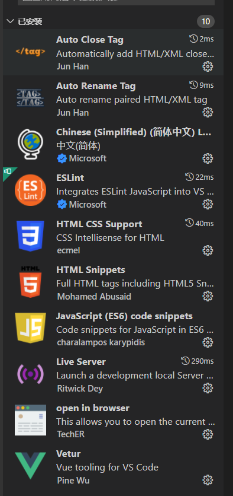
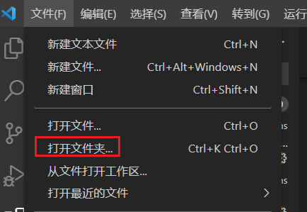
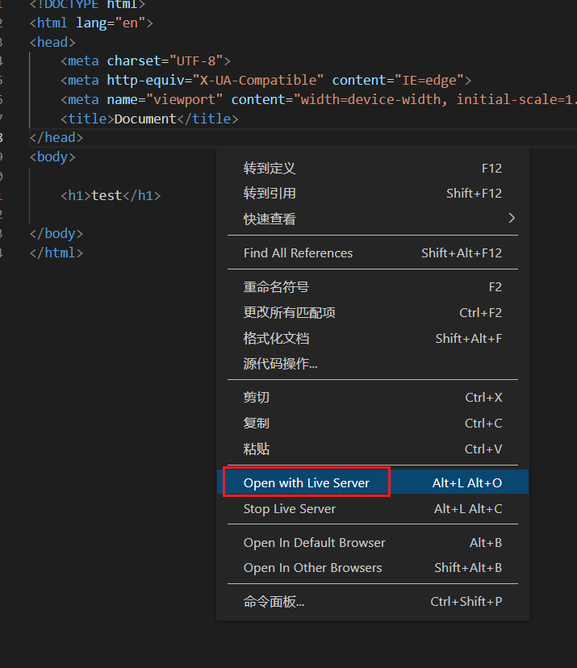
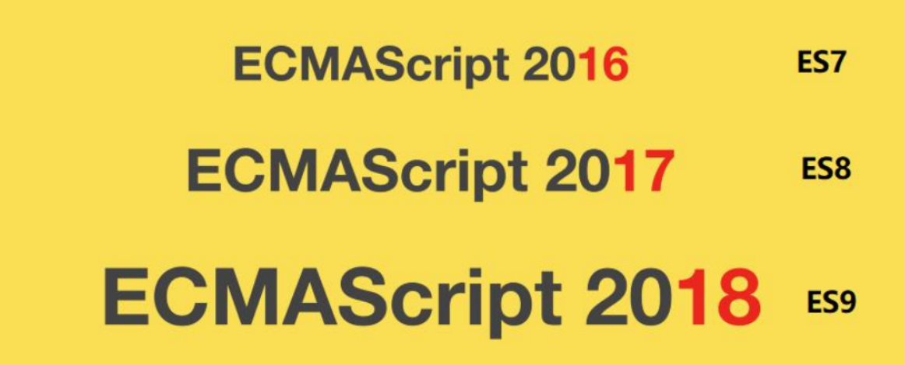
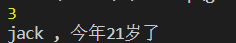

谷粒商城

前端开发基础知识&快速入门 


## 一、VSCode 使用


### 1、安装常用插件 

切换到插件标签页 

安装以下基本插件 




### 2、创建项目 

vscode 很轻量级，本身没有新建项目的选项，创建一个空文件夹就可以当做一个项目




### 3、创建网页 

创建文件，命名为 index.html 

快捷键 ! ，快速创建网页模板

 h1 + 回车，自动补全标签 


### 4、运行效果 



如果使用 live server，页面内容变化，保存以后，浏览器会自动变化； 


## 二、ES6 


### 1、简介 


**ECMAScript 6.0**（以下简称 ES6，ECMAScript 是一种由 Ecma 国际(前身为欧洲计算机制造商协会,英文名称是 European Computer Manufacturers Association)通过 ECMA-262标准化的脚本程序设计语言）**是 JavaScript 语言的下一代标准**，已经在 2015 年 6 月正式发布了，并且从 ECMAScript 6 开始，开始采用年号来做版本。即 ECMAScript 2015，就是ECMAScript6。它的目标，是使得 JavaScript 语言可以用来编写复杂的大型应用程序，成为企业级开发语言。**每年一个新版本**。 





### 2、什么是 ECMAScript 


来看下前端的发展历程： 


- web1.0 时代： 

  最初的网页以 HTML 为主，是纯静态的网页。网页是只读的，信息流只能从服务的到客户端单向流通。**开发人员也只关心页面的样式和内容**即可。 


- web2.0 时代： 
  - 1995 年，网景工程师 Brendan Eich 花了 10 天时间设计了 JavaScript 语言。
  - 1996 年，微软发布了 JScript，其实是 JavaScript 的逆向工程实现。
  - 1996 年 11 月，JavaScript 的创造者 Netscape 公司，决定将 JavaScript 提交给标准化组织 ECMA，希望这种语言能够成为国际标准。
  -  1997 年，ECMA 发布 262 号标准文件（ECMA-262）的第一版，规定了浏览器脚本语言的标准，并将这种语言称为 ECMAScript，这个版本就是 1.0 版。JavaScript 和JScript 都是`ECMAScript`的标准实现者，随后各大浏览器厂商纷纷实现了`ECMAScript`标准。 


​	所以，ECMAScript 是浏览器脚本语言的规范，而各种我们熟知的 js 语言，如**JavaScript 则是规范的具体实现**。 


### 3、ES6 新特性 


#### 1、let 声明变量

```javascript
//var 声明的变量往往会越域
//let 声明的变量有严格的局部作用域
{
    var a = 1;
    let b = 2;
}
// console.log(a)  // 1
// console.log(b)  // ReferenceError: b is not defined


// var 可以声明多次
// let 只能声明一次
var m = 1;
var m = 2;
let n = 3
// let n = 4;  //Cannot redeclare block-scoped variable 'n'.javascrip

// console.log(m);
// console.log(n); //SyntaxError: Identifier 'n' has already been declared


// var 会变量提示
// let 不存在变量提升
console.log(x); //undefined
var x = 10;

console.log(y); //Uncaught ReferenceError: Cannot access 'y' before initialization
let y = 20;

```


#### 2、const 声明常量（只读变量）

```javascript
// 1.声明之后不允许改变
// 2.一旦声明必须初始化 否则会报错
const a = 1;
a = 3;  //2.const.html:16 Uncaught TypeError: Assignment to constant variable.
```


#### 3、解构表达式 


1）、数组解构

```javascript
// 1）数组结构
let arr = [1,2,3];
// 以前我们想获取其中的值，只能通过角标 

let a = arr[0];
let b = arr[1];
let c = arr[2];
console.log(a,b,c);

// ES6可以这样：
const[x,y,z] = arr; //x y z 将与arr 中的每个位置对应来取值

console.log(x,y,z);
```


 let arr = [1,2,3]; //以前我们想获取其中的值，只能通过角标。ES6 可以这样：const [x,y,z] = arr;// x，y，z 将与 arr 中的每个位置对应来取值// 然后打印 console.log(x,y,z);


 2）、对象解构 

```javascript
// 2)对象解构
const person = {
    name: "Jack",
    age: "20",
    language: ["java","js","css"]
}

// 解构表达式获取值 将person里面每一个属性和左边对应赋值
// const {name,age,language} = person;

// 等价下面
// const name = person.name;
// const age = person.age;
// const language = person.language;

// console.log(name);
// console.log(age);
// console.log(language);

// 扩展： 如果想要将name的值 赋值给其他变量 可以如下， nn时新的变量名
const {name: nn ,age, language} = person;
console.log(nn);
console.log(age);
console.log(language);
```


#### 4、字符串扩展 

1）、几个新的 API ES6 为字符串扩展了几个新的 API： 

```javascript
// `includes()`：返回布尔值，表示是否找到了参数字符串。
// `startsWith()`：返回布尔值，表示参数字符串是否在原字符串的头部。
// `endsWith()`：返回布尔值，表示参数字符串是否在原字符串的尾部。

let str = "hello.vue";  
console.log(str.startsWith("hello"));   //true
console.log(str.endsWith("vue")); //true
console.log(str.includes("e")); //true
console.log(str.includes("hello")); //true
```


2）、字符串模板 


模板字符串相当于加强版的字符串，用反引号 ` ,除了作为普通字符串，还可以用来定义多行字符串，还可以在字符串中加入变量和表达式。 


```javascript
// 2）字符串模板
// 1.多行字符串
let ss = `
<div>
<span>hello world</span>
</div>
`
console.log(ss);

// 2.字符串插入变量和表达式。变量名写在 ${} 中 ，${} 中可以放入JavaScript表达式
let name =  "张三";
let age = 20;
let info = `我是${name} , 今年 ${age} 岁了`;
console.log(info)

let info2 = `我是${name} , 今年 ${age + 20} 岁了`;
console.log(info2)


// 3.字符串中调用函数
function fun(){
    return "这是一个函数";
}

let sss = `调用函数 ~， ${fun()}`;

console.log(sss)
```


#### 5、函数优化 


##### 1）、函数参数默认值 

```javascript
// 在ES6 以前，我们无法给一个函数参数设置默认值，只能采用变通写法
function add(a,b){
    // 判断b 是否为空，为空就给默认值 1
    b = b || 1;
    return a + b;
}

// 传一个参数
console.log(add(10));

// 现在可以这样写 ： 直接给参数写上默认值，没传就会自动使用默认值
function add2(a, b = 1){
    return a + b;
}
// 传一个参数
console.log(add2(20))
```


##### 2）、不定参数 

不定参数用来表示不确定参数个数，形如，...变量名，**由...加上一个具名参数标识符组成**。具名参数**只能放在参数列表的最后**，并且**有且只有一个不定参数**

```javascript
// 2）不定参数
function fun(...values){
    console.log(values.length);
}

fun(1,2);   //2
fun(2,3,4,5,6)  //5
```


##### 3）、箭头函数 


ES6 中定义函数的简写方式 

- 一个参数时：

```javascript
// 以前声明一个方法
// var print = function(obj){
//     console.log(obj);
// }
// 可以简写
var print = obj => console.log(obj);

// 测试
print(200)
```


- 多个参数： 

```javascript
// 两个参数情况;
var sum = function(a,b){
    return a + b;
}

// 测试
console.log(sum(10 , 20))     //30

//简写
var sum2 = (a,b) => a+b;
console.log(sum2(20,30));   //50


// 代码不只一行 可以用 {} 
var sum3 = (a,b) => {
    c = a + b;
    return c;
}
console.log(sum3(20,40));   //60
```


##### 4）、实战：箭头函数结合解构表达式 

```javascript

// 以前的方法
const person = {
    name: "Jack",
    age: 38,
    language: ["java","php","c++"]
}

function hello(person){
    console.log("hello:" + person.name)
}

//测试
hello(person);

//现在的方式
var hello2 = ({ name }) => { console.log("hello:" + name )}

//测试
hello2(person);
```


#### 6、对象优化 

##### 1）、新增的 API 

ES6 给 Object 拓展了许多新的方法，如：

- keys(obj)：获取对象的所有 key 形成的数组 

- values(obj)：获取对象的所有 value 形成的数组 

- entries(obj)：获取对象的所有 key 和 value 形成的二维数组。格式：`[[k1,v1],[k2,v2],...]` 

- assign(dest, ...src) ：将多个 src 对象的值 拷贝到 dest 中。（第一层为深拷贝，第二层为浅拷贝） 

  

```javascript
// - keys(obj)：获取对象的所有 key 形成的数组 
// - values(obj)：获取对象的所有 value 形成的数组 
// - entries(obj)：获取对象的所有 key 和 value 形成的二维数组。格式：`[[k1,v1],[k2,v2],...]` 
// - assign(dest, ...src) ：将多个 src 对象的值 拷贝到 dest 中。（第一层为深拷贝，第二层为浅拷贝） 

const person = {
    name : "Jack",
    age: 22,
    language: ["java","php","c++"]
}
console.log(Object.keys(person))    //['name', 'age', 'language']
console.log(Object.values(person))  //['Jack', 22, Array(3)]
console.log(Object.entries(person))  //[Array(2), Array(2), Array(2)]


const target = { a : 1};
const source1 = { b : 2};
const source2 = { c : 3};
// Object.assign 方法第一个参数时目标对象，后面的参数都是源对象
Object.assign(target,source1,source2);

console.log(target) //{a: 1, b: 2, c: 3}
```


##### 2）、声明对象简写 

```javascript
// 2） 声明对象简写
const age = 23;
const name = "张三";

// 传统
const person1 = {age:age, name:name};
console.log(person1)

// ES6:属性名和属性值一样，可以省略
const person2 ={ age , name};
console.log(person2)    //{age: 23, name: '张三'}
```


##### 3）、对象的函数属性简写 

```java
//3) 对象的函数属性简写

let personT = {
    name : "Tom",

    // 以前
    eat: function(food){
        console.log(this.name + "在吃" + food);
    },

    // 箭头函数版：这里拿不到this
    // eat2: food => console.log(this.name + "在吃" + food),
    eat2: food => console.log(personT.name + "在吃" + food),
    // 简写版
    eat3: function(food){
        console.log(this.name + "在吃" + food);
    }
}

personT.eat("香蕉");
personT.eat2("苹果");
personT.eat3("桔子");

//Tom在吃香蕉
//Tom在吃苹果
//Tom在吃桔子
```


##### 4）、对象拓展运算符 

拓展运算符（...）用于取出参数对象所有可遍历属性然后拷贝到当前对象。

```javascript
// 4) 对象扩展运算符
// 拓展运算符（...）用于取出参数对象所有可遍历属性然后拷贝到当前对象。
// 1.拷贝对象（深拷贝）
let person3 = {name : "Amy" , age: 18};
let someone = {...person3};
console.log(someone) //{name: 'Amy', age: 18}

// 2.合并对象
let age2 = { age : 17};
let name2 = { name : "Tom"};

//如果两个对象的字段名重复，后面对象字段会覆盖前面对象的字段值
let person4 = {...age2,...name2};

console.log(person4); //{age: 17, name: 'Tom'}
```


#### 7、map 和 reduce 

数组中新增了 map 和 reduce 方法。 


##### 1）、map 

map()：接收一个函数，将原数组中的所有元素用这个函数处理后放入新数组返回。let arr = ['1', '20', '-5', '3']; console.log(arr) arr = arr.map(s => parseInt(s)); console.log(arr) 

```javascript
let arr = ['1', '20', '-5', '3'];
console.log(arr)
arr = arr.map(s => parseInt(s));
console.log(arr)
```


##### 2）、reduce 

语法： 

arr.reduce(callback,[initialValue]) 

reduce 为数组中的每一个元素依次执行回调函数，不包括数组中被删除或从未被赋值的元素，接受四个参数：初始值（或者上一次回调函数的返回值），当前元素值，当前索引，调用 reduce 的数组。


 callback （执行数组中每个值的函数，包含四个参数） 

1、previousValue （上一次调用回调返回的值，或者是提供的初始值（initialValue））

2、currentValue （数组中当前被处理的元素） 

3、index （当前元素在数组中的索引） 

4、array （调用 reduce 的数组） initialValue （作为第一次调用 callback 的第一个参数。）


示例： 

```javascript
let result = arr.reduce((a,b) => {
    console.log("上一次调用函数返回的值： " + a)
    console.log("当前正在处理的值： " + b)

    return a + b;
})
console.log(result) //-4

console.log("-----------------------------------------------------------") 


let result2 = arr.reduce((a,b) => {
    console.log("上一次调用函数返回的值： " + a)
    console.log("当前正在处理的值： " + b)

    return a + b;
},100)      //初始值 100  ，再依次相加 initialValue
console.log(result2) //96

console.log("-----------------------------------------------------------") 

const arr2 = [1,20,-5,3];
// 没有初始值
console.log(arr2.reduce( (a,b) => a + b ))  //19 1+20+(-5)+3
console.log(arr2.reduce( (a,b) => a * b ))  //-300  1*20*(-5)*3

// 指定初始值
console.log(arr2.reduce( (a,b) => a+b ,1  ))    //20    1+1+20+(-5)+3
console.log(arr2.reduce( (a,b) => a*b ,0 ))     // -0   0*(1*20*(-5)*3)

console.log("-----------------------------------------------------------") 
```


#### 8、Promise 

在 JavaScript 的世界中，所有代码都是单线程执行的。

由于这个“缺陷”，导致JavaScript 的所有网络操作，浏览器事件，都必须是异步执行。异步执行可以用回调函数实现。一旦有一连串的 ajax 请求 a,b,c,d... 后面的请求依赖前面的请求结果，就需要层层嵌套。这种缩进和层层嵌套的方式，非常容易造成上下文代码混乱，我们不得不非常小心翼翼处理内层函数与外层函数的数据，一旦内层函数使用了上层函数的变量，这种混乱程度就会加剧......总之，这种`层叠上下文`的层层嵌套方式，着实增加了神经的紧张程度。 


案例：用户登录，并展示该用户的各科成绩。在页面发送两次请求：

1. 查询用户，查询成功说明可以登录 
2. 查询用户成功，查询科目 
3. 根据科目的查询结果，获取去成绩 


分析：此时后台应该提供三个接口，一个提供用户查询接口，一个提供科目的接口，一个提供各科成绩的接口，为了渲染方便，最好响应 json 数据。

在这里就不编写后台接口了，而是提供三个 json 文件，直接提供 json 数据，模拟后台接口：


user.json：

```json
{
    "id": 1,
    "name": "zhangsan",
    "password": "123456"
}
```


user_corse_1.json:

```json
{
    "id": 10,
    "name": "chinese"
}
```


corse_score_10.json:

```json
{
    "id": 100,
    "score": 90
}
```


```javascript
//回调函数嵌套的噩梦：层层嵌套。
$.ajax({
    url: "mock/user.json",
    success(data) {
        console.log("查询用户：", data);
        $.ajax({
            url: `mock/user_corse_${data.id}.json`,
            success(data) {
                console.log("查询到课程：", data);
                $.ajax({
                    url: `mock/corse_score_${data.id}.json`,
                    success(data) {
                        console.log("查询到分数：", data);
                    },
                    error(error) {
                        console.log("出现异常了：" + error);
                    }
                });
            },
            error(error) {
                console.log("出现异常了：" + error);
            }
        });
    },
    error(error) {
        console.log("出现异常了：" + error);
    }
});
```

我们可以通过 Promise 解决以上问题。 


##### 1）、Promise 语法 

```javascript
const promise = new Promise(function (resolve, reject) {
    // 执行异步操作
    if (/* 异步操作成功 */) {
        resolve(value);// 调用 resolve，代表 Promise 将返回成功的结果} else {
    reject(error);// 调用 reject，代表 Promise 会返回失败结果}
});
```


使用箭头函数可以简写为： 

```javascript
const promise = new Promise((resolve, reject) =>{
    // 执行异步操作
    if (/* 异步操作成功 */) {
        resolve(value);// 调用 resolve，代表 Promise 将返回成功的结果} else {
    reject(error);// 调用 reject，代表 Promise 会返回失败结果}
});
```

这样，在 promise 中就封装了一段异步执行的结果。


#####  2）、处理异步结果 

如果我们想要等待异步执行完成，做一些事情，我们可以通过 promise 的then 方法来实现。如果想要处理 promise 异步执行失败的事件，还可以跟上 catch： 

```javascript
promise.then(function (value) {
    // 异步执行成功后的回调
}).catch(function (error) {
    // 异步执行失败后的回调
})
```


##### 3）、Promise 改造以前嵌套方式

```javascript
new Promise((resolve, reject) => {
    $.ajax({
        url: "mock/user.json",
        success(data) {
            console.log("查询用户：", data);
            resolve(data.id);
        },
        error(error) {
            console.log("出现异常了：" + error);
        }
    });
}).then((userId) => {
    return new Promise((resolve, reject) => {
        $.ajax({
            url: `mock/user_corse_${userId}.json`,
            success(data) {
                console.log("查询到课程：", data);
                resolve(data.id);
            },
            error(error) {
                console.log("出现异常了：" + error);
            }
        });
    });
}).then((corseId) => {
    console.log(corseId);
    $.ajax({
        url: `mock/corse_score_${corseId}.json`,
        success(data) {
            console.log("查询到分数：", data);
        },
        error(error) {
            console.log("出现异常了：" + error);
        }
    });
});
```


##### 4）、优化处理 


优化：通常在企业开发中，会把 promise 封装成通用方法，如下：封装了一个通用的get 请求方法； 


```javascript
let get = function (url, data) { // 实际开发中会单独放到common.js中

    return new Promise((resolve, reject) => {
        $.ajax({
            url: url,
            type: "GET",
            data: data,
            success(result) {
                resolve(result);
            },
            error(error) {
                reject(error);
            }
        });
    })
}

// 使用封装的 get 方法，实现查询分数
get("mock/user.json").then((result) => {
    console.log("查询用户：", result);
    return get(`mock/user_corse_${result.id}.json`);
}).then((result) => {
    console.log("查询到课程：", result);
    return get(`mock/corse_score_${result.id}.json`)
}).then((result) => {
    console.log("查询到分数：", result);
}).catch(() => {
    console.log("出现异常了：" + error);
});
```


通过比较，我们知道了 Promise 的扁平化设计理念，也领略了这种`上层设计`带来的好处。我们的项目中会使用到这种异步处理的方式； 


#### 9、模块化 

##### 1）、什么是模块化 

模块化就是把代码进行拆分，方便重复利用。类似 java 中的导包：要使用一个包，必须先导包。而 JS 中没有包的概念，换来的是 **模块**。 


模块功能主要由两个命令构成：`export`和`import`。

- `export`命令用于规定模块的对外接口。 

- `import`命令用于导入其他模块提供的功能。 


##### 2）、export 

比如我定义一个 js 文件:hello.js，里面有一个对象 

```javascript
const util = {
    sum(a,b){
        return a + b;
    }
}
```


我可以使用 export 将这个对象导出： 

```javascript
const util = {
    sum(a, b) {
        return a + b;
    }
}

export {util}
```


当然，也可以简写为： 

```javascript
export const util = {
    sum(a,b){
        return a + b;
    }
}
```


`export`不仅可以导出对象，一切 JS 变量都可以导出。

比如：基本类型变量、函数、数组、对象。 当要导出多个值时，还可以简写。

比如我有一个文件：user.js： 

```javascript
var name = "jack"
var age = 21
export {name,age}
```


```markdown
省略名称 
上面的导出代码中，都明确指定了导出的变量名，这样其它人在导入使用时就必须准确写出变量名，否则就会出错。 

因此 js 提供了`default`关键字，可以对导出的变量名进行省略 
```

例如： 

```javascript
// 无需声明对象的名字
export default {
    sum(a,b){
        return a + b;
    }
}
```

这样，当使用者导入时，可以任意起名字 


##### 3）、import

 使用`export`命令定义了模块的对外接口以后，其他 JS 文件就可以通过`import`命令加载这个模块。 

例如我要使用上面导出的 util： 

```javascript
// 导入 util
import { util } from "./hello";
import {name, age} from './user.js'

// 调用 util 中的属性
console.log(util.sum(1,2))
console.log(name + " , 今年"+ age +"岁了")
```


但是上面的代码暂时无法测试，因为浏览器目前还不支持 ES6 的导入和导出功能。除非借助于工具，把 ES6 的语法进行编译降级到 ES5，比如`Babel-cli`工具 。 


**注意：这时的程序无法运行的，因为ES6的模块化无法在Node.js中执行，需要用Babel编辑成ES5后再执行。**


##### 使用Babel转码

ES6的某些高级语法在浏览器环境甚至是Node.js环境中无法执行。

Babel是一个广泛使用的转码器，可以将ES6代码转为ES5代码，从而在现有环境执行执行。

这意味着，你可以现在就用 ES6 编写程序，而不用担心现有环境是否支持。

安装

Babel提供babel-cli工具，用于命令行转码。它的安装命令如下：

```sh
#全局安装
npm install -g babel-cli
#查看是否安装成功
babel --version
```


#####  安装异常

```markdown
babel : 无法加载文件 C:\Users\win\AppData\Roaming\npm\babel.ps1，因为在此系统上禁止运行脚本。
```

##### 解决

https://www.cnblogs.com/Courage129/p/13968820.html

```markdown
1. vscode 管理员启动
2.如果还不行,在vscode终端获取执行政策: get-ExecutionPolicy
3.如果得到的政策是限制:Restricted ,则重新设置执行策略为可远程的:set-ExecutionPolicy RemoteSigned,然后再获取执行政策:
4.再查看babel版本,显示成功!
```


初始化项目

在modularization目录下初始化项目

```shell
npm init -y
```

 

配置.babelrc

Babel的配置文件是.babelrc，存放在项目的根目录下，该文件用来设置转码规则和插件，presets字段设定转码规则

```json
{
    "presets": [
        "es2015"
    ],
    "plugins": []
}
```

 

安装转码器

在modularization目录中安装

```sh
npm install -D babel-preset-es2015
```

 

转码

```sh
# 整个目录转码
# --out-dir 或 -d 参数指定输出目录
babel js -d dist   
```

 

运行程序

```
node .\dist\main.js
```

 

结果




## 三、Node.js 


前端开发，少不了 node.js；Node.js 是一个基于 Chrome V8 引擎的JavaScript 运行环境。

http://nodejs.cn/api/ 


我们关注与 node.js 的 npm 功能就行； 

NPM 是随同 NodeJS 一起安装的包管理工具，JavaScript-NPM，Java-Maven；


1）、官网下载安装 node.js，并使用 node -v 检查版本 

2）、配置 npm 使用淘宝镜像 

npm config set registry http://registry.npm.taobao.org/ 

新淘宝镜像 npm config set registry=https://registry.npmmirror.com

3）、大家如果 npm install 安装依赖出现 chromedriver 之类问题，先在项目里运行下面命令npm install chromedriver --chromedriver_cdnurl=http://cdn.npm.taobao.org/dist/chromedriver 

然后再运行 npm install 


## 四、Vue 


1、MVVM 思想  M：即 Model，模型，包括数据和一些基本操作  V：即 View，视图，页面渲染结果  VM：即 View-Model，模型与视图间的双向操作（无需开发人员干涉）在 MVVM 之前，开发人员从后端获取需要的数据模型，然后要通过DOM操作Model 渲染到 View 中。而后当用户操作视图，我们还需要通过 DOM 获取 View 中的数据，然后同步到Model 中。 而 MVVM 中的 VM 要做的事情就是把 DOM 操作完全封装起来，开发人员不用再关心Model 和 View 之间是如何互相影响的：  只要我们 Model 发生了改变，View 上自然就会表现出来。  当用户修改了 View，Model 中的数据也会跟着改变。 把开发人员从繁琐的 DOM 操作中解放出来，把关注点放在如何操作Model 上。


2、Vue 简介 Vue (读音 /vjuː/，类似于 view) 是一套用于构建用户界面的渐进式框架。与其它大型框架不同的是，Vue 被设计为可以自底向上逐层应用。Vue 的核心库只关注视图层，不仅易于上手，还便于与第三方库或既有项目整合。另一方面，当与现代化的工具链以及各种支持类库结合使用时，Vue 也完全能够为复杂的单页应用提供驱动。 官网：https://cn.vuejs.org/ 参考：https://cn.vuejs.org/v2/guide/ Git 地址：https://github.com/vuejs 尤雨溪，Vue.js 创作者，Vue Technology 创始人，致力于 Vue 的研究开发。3、入门案例 1）、安装 官网文档提供了 3 中安装方式： 1. 直接 script 引入本地 vue 文件。需要通过官网下载 vue 文件。 2. 通过 script 引入 CDN 代理。需要联网，生产环境可以使用这种方式 3. 通过 npm 安装。这种方式也是官网推荐的方式，需要 nodejs 环境。本课程就采用第三种方式 2）、创建示例项目 1、新建文件夹 hello-vue，并使用 vscode 打开 2、使用 vscode 控制台，npm install -y； 项目会生成 package-lock.json 文件，类似于 maven 项目的 pom.xml 文件。3、使用 npm install vue，给项目安装 vue；项目下会多 node_modules 目录，并且在下面有一个 vue 目录。 3）、HelloWorld 在 hello.html 中，我们编写一段简单的代码。 h2 中要输出一句话：`xx 非常帅`。前面的`xx`是要渲染的数据。 4）、vue 声明式渲染 页面代码

# {{name}}，非常帅！！！

 首先通过 new Vue()来创建 Vue 实例  然后构造函数接收一个对象，对象中有一些属性：  el：是 element 的缩写，通过 id 选中要渲染的页面元素，本例中是一个div  data：数据，数据是一个对象，里面有很多属性，都可以渲染到视图中 name：这里我们指定了一个 name 属性  页面中的`h2`元素中，我们通过{{name}}的方式，来渲染刚刚定义的name 属性。打开页面查看效果： 更神奇的在于，当你修改 name 属性时，页面会跟着变化： 5）、双向绑定 我们对刚才的案例进行简单修改：

## {{name}}，非常帅！！！有{{num}}个人为他点赞。

双向绑定： 效果：我们修改表单项，num 会发生变化。我们修改 num，表单项也会发生变化。为了实时观察到这个变化，我们将 num 输出到页面。 我们不需要关注他们为什么会建立起来关联，以及页面如何变化，我们只需要做好数据和视图的关联即可（MVVM） 6）、事件处理 给页面添加一个按钮：

关注

## {{name}}，非常帅！！！有{{num}}个人为他点赞。

 这里用`v-on`指令绑定点击事件，而不是普通的`onclick`，然后直接操作num 普通 click 是无法直接操作 num 的。  未来我们会见到更多 v-xxx，这些都是 vue 定义的不同功能的指令。简单使用总结： 1）、使用 Vue 实例管理 DOM 2）、DOM 与数据/事件等进行相关绑定 3）、我们只需要关注数据，事件等处理，无需关心视图如何进行修改4、概念 1、创建 Vue 实例 每个 Vue 应用都是通过用 Vue 函数创建一个新的 Vue 实例开始的：let app = new Vue({ }); 在构造函数中传入一个对象，并且在对象中声明各种 Vue 需要的数据和方法，包括：- el - data - methods 等等 接下来我们一 一介绍。 2、模板或元素 每个 Vue 实例都需要关联一段 Html 模板，Vue 会基于此模板进行视图渲染。我们可以通过 el 属性来指定。 例如一段 html 模板：


然后创建 Vue 实例，关联这个 div let vm = new Vue({ el: "#app" }) 这样，Vue 就可以基于 id 为`app`的 div 元素作为模板进行渲染了。在这个div 范围以外的部分是无法使用 vue 特性的。 3、数据 当 Vue 实例被创建时，它会尝试获取在 data 中定义的所有属性，用于视图的渲染，并且监视 data 中的属性变化，当 data 发生改变，所有相关的视图都将重新渲染，这就是“响应式“系统。 html：


JS: let vm = new Vue({ el: "#app", data: { name: "刘德华" } })  name 的变化会影响到`input`的值  input 中输入的值，也会导致 vm 中的 name 发生改变 4、方法 Vue 实例中除了可以定义 data 属性，也可以定义方法，并且在 Vue 实例的作用范围内使用。Html：

{{num}} 加

JS： let vm = new Vue({ el: "#app", data: { num: 0 }, methods: { add: function () { // this 代表的当前 vue 实例 this.num++; } } }) 5、安装 vue-devtools 方便调试 将软件包中的 vue-devtools 解压。  打开 chrome 设置->扩展程序  开启开发者模式，并加载插件  打开浏览器控制台，选择 vue 6、安装 vscode 的 vue 插件 安装这个插件就可以有语法提示 5、指令 什么是指令？  指令 (Directives) 是带有 `v-` 前缀的特殊特性。  指令特性的预期值是：单个 JavaScript 表达式。  指令的职责是，当表达式的值改变时，将其产生的连带影响，响应式地作用于DOM。 例如我们在入门案例中的 v-on，代表绑定事件。 1、插值表达式 1）、花括号 格式：{{表达式}} 说明：  该表达式支持 JS 语法，可以调用 js 内置函数（必须有返回值） 表达式必须有返回结果。例如 1 + 1，没有结果的表达式不允许使用，如：let a = 1 + 1;  可以直接获取 Vue 实例中定义的数据或函数 2）、插值闪烁 使用{{}}方式在网速较慢时会出现问题。在数据未加载完成时，页面会显示出原始的`{{}}`，加载完毕后才显示正确数据，我们称为插值闪烁。 我们将网速调慢一些，然后刷新页面，试试看刚才的案例： 3）、v-text 和 v-html 可以使用 v-text 和 v-html 指令来替代{{}} 说明：  v-text：将数据输出到元素内部，如果输出的数据有 HTML 代码，会作为普通文本输出 v-html：将数据输出到元素内部，如果输出的数据有 HTML 代码，会被渲染示例：

v-text: 
 v-html:

效果： 并且不会出现插值闪烁，当没有数据时，会显示空白或者默认数据。2、v-bind html 属性不能使用双大括号形式绑定，我们使用 v-bind 指令给 HTML 标签属性绑定值；而且在将 `v-bind` 用于 `class` 和 `style` 时，Vue.js 做了专门的增强。1）、绑定 class


2）、绑定 style `v-bind:style` 的对象语法十分直观，看着非常像 CSS，但其实是一个JavaScript 对象。style属性名可以用驼峰式 (camelCase) 或短横线分隔 (kebab-case，这种方式记得用单引号括起来) 来命名。 例如：font-size-->fontSize

结果：

3）、绑定其他任意属性


效果：

4）、v-bind 缩写


3、v-model 刚才的 v-text、v-html、v-bind 可以看做是单向绑定，数据影响了视图渲染，但是反过来就不行。接下来学习的 v-model 是双向绑定，视图（View）和模型（Model）之间会互相影响。既然是双向绑定，一定是在视图中可以修改数据，这样就限定了视图的元素类型。目前v-model 的可使用元素有： - input - select - textarea - checkbox - radio - components（Vue 中的自定义组件） 基本上除了最后一项，其它都是表单的输入项。 示例：

Java

PHP

Swift

# 你选择了：{{language.join(',')}}

 多个`CheckBox`对应一个 model 时，model 的类型是一个数组，单个checkbox 值默认是boolean 类型  radio 对应的值是 input 的 value 值  `text` 和`textarea` 默认对应的 model 是字符串  `select`单选对应字符串，多选对应也是数组 效果： 4、v-on 1、基本用法 v-on 指令用于给页面元素绑定事件。 语法： v-on:事件名="js 片段或函数名" 示例：

点赞取消

# 有{{num}}个赞

另外，事件绑定可以简写，例如`v-on:click='add'`可以简写为`@click='add'` 2、事件修饰符 在事件处理程序中调用 `event.preventDefault()` 或 `event.stopPropagation()` 是非常常见的需求。尽管我们可以在方法中轻松实现这点，但更好的方式是：方法只有纯粹的数据逻辑，而不是去处理 DOM 事件细节。 为了解决这个问题，Vue.js 为 `v-on` 提供了事件修饰符。修饰符是由点开头的指令后缀来表示的。  `.stop` ：阻止事件冒泡到父元素  `.prevent`：阻止默认事件发生  `.capture`：使用事件捕获模式  `.self`：只有元素自身触发事件才执行。（冒泡或捕获的都不执行） `.once`：只执行一次

点赞
取消

# 有{{num}}个赞

效果：右键“点赞”，不会触发默认的浏览器右击事件；右键“取消”，会触发默认的浏览器右击事件） 3、按键修饰符 在监听键盘事件时，我们经常需要检查常见的键值。Vue 允许为 `v-on` 在监听键盘事件时添加按键修饰符：

记住所有的 `keyCode` 比较困难，所以 Vue 为最常用的按键提供了别名：

全部的按键别名：  `.enter`  `.tab`  `.delete` (捕获“删除”和“退格”键)  `.esc`  `.space`  `.up`  `.down`  `.left`  `.right` 4、组合按钮 可以用如下修饰符来实现仅在按下相应按键时才触发鼠标或键盘事件的监听器。 `.ctrl`  `.alt`  `.shift`

Do something

5、v-for 遍历数据渲染页面是非常常用的需求，Vue 中通过 v-for 指令来实现。1、遍历数组 语法：v-for="item in items"  items：要遍历的数组，需要在 vue 的 data 中定义好。  item：迭代得到的当前正在遍历的元素 示例：

- {{user.name}} - {{user.gender}} - {{user.age}}

效果： 2、数组角标 在遍历的过程中，如果我们需要知道数组角标，可以指定第二个参数：语法：v-for="(item,index) in items"  items：要迭代的数组  item：迭代得到的数组元素别名  index：迭代到的当前元素索引，从 0 开始。 示例：

- {{index + 1}}. {{user.name}} - {{user.gender}} - {{user.age}}

效果： 3、遍历对象 v-for 除了可以迭代数组，也可以迭代对象。语法基本类似 语法： v-for="value in object" v-for="(value,key) in object" v-for="(value,key,index) in object"  1 个参数时，得到的是对象的属性值  2 个参数时，第一个是属性值，第二个是属性名  3 个参数时，第三个是索引，从 0 开始 示例：

- {{index + 1}}. {{key}} - {{value}}

效果： 4、Key 用来标识每一个元素的唯一特征，这样 Vue 可以使用“就地复用”策略有效的提高渲染的效率。 示例：

- 

- 

最佳实践： 如果 items 是数组，可以使用 index 作为每个元素的唯一标识 如果 items 是对象数组，可以使用 item.id 作为每个元素的唯一标识 6、v-if 和 v-show 1、基本用法 v-if，顾名思义，条件判断。当得到结果为 true 时，所在的元素才会被渲染。v-show，当得到结果为 true 时，所在的元素才会被显示。 语法：v-if="布尔表达式", v-show="布尔表达式", 示例：

点我呀

# 看到我啦？！

# 看到我啦？！show

2、与 v-for 结合 当 v-if 和 v-for 出现在一起时，v-for 优先级更高。也就是说，会先遍历，再判断条件。修改 v-for 中的案例，添加 v-if：

- {{index + 1}}. {{user.name}} - {{user.gender}} - {{user.age}}

效果：只显示女性 7、v-else 和 v-else-if v-else 元素必须紧跟在带 `v-if` 或者 `v-else-if` 的元素的后面，否则它将不会被识别。示例：

点我呀{{random}}

# 看到我啦？！v-if >= 0.75

# 看到我啦？！v-else-if > 0.5

# 看到我啦？！v-else-if > 0.25

# 看到我啦？！v-else

6、计算属性和侦听器 1、计算属性（computed） 某些结果是基于之前数据实时计算出来的，我们可以利用计算属性。来完成示例：

- 西游记：价格{{xyjPrice}}，数量：
- 水浒传：价格{{shzPrice}}，数量：
- 总价：{{totalPrice}}

效果：只要依赖的属性发生变化，就会重新计算这个属性 2、侦听（watch） watch 可以让我们监控一个值的变化。从而做出相应的反应。 示例：

- 西游记：价格{{xyjPrice}}，数量：
- 水浒传：价格{{shzPrice}}，数量：
- 总价：{{totalPrice}}
- {{msg}}

效果： 3、过滤器（filters） 过滤器不改变真正的`data`，而只是改变渲染的结果，并返回过滤后的版本。在很多不同的情况下，过滤器都是有用的，比如尽可能保持 API 响应的干净，并在前端处理数据的格式。示例：展示用户列表性别显示男女

| {{user.id}} | {{user.name}} | {{user.gender===1? "男":"女"}} |
| ----------- | ------------- | ------------------------------ |
|             |               |                                |

1、局部过滤器 注册在当前 vue 实例中，只有当前实例能用 let app = new Vue({ el: "#app", data: { userList: [ { id: 1, name: 'jacky', gender: 1 }, { id: 2, name: 'peter', gender: 0 } ] }, // filters 定义局部过滤器，只可以在当前 vue 实例中使用filters: { genderFilter(gender) { return gender === 1 ? '男~' : '女~' } } }); {{user.gender | genderFilter}} 2、全局过滤器 // 在创建 Vue 实例之前全局定义过滤器： Vue.filter('capitalize', function (value) { return value.charAt(0).toUpperCase() + value.slice(1) }) 任何 vue 实例都可以使用： {{user.name | capitalize}} 过滤器常用来处理文本格式化的操作。过滤器可以用在两个地方：双花括号插值和v-bind表达式 7、组件化 在大型应用开发的时候，页面可以划分成很多部分。往往不同的页面，也会有相同的部分。例如可能会有相同的头部导航。 但是如果每个页面都独自开发，这无疑增加了我们开发的成本。所以我们会把页面的不同部分拆分成独立的组件，然后在不同页面就可以共享这些组件，避免重复开发。在 vue 里，所有的 vue 实例都是组件 1、全局组件 我们通过 Vue 的 component 方法来定义一个全局组件。


 组件其实也是一个 Vue 实例，因此它在定义时也会接收：data、methods、生命周期函数等  不同的是组件不会与页面的元素绑定，否则就无法复用了，因此没有el 属性。 但是组件渲染需要 html 模板，所以增加了 template 属性，值就是HTML 模板 全局组件定义完毕，任何 vue 实例都可以直接在 HTML 中通过组件名称来使用组件了 data 必须是一个函数，不再是一个对象。 2、组件的复用 定义好的组件，可以任意复用多次：


组件的 data 属性必须是函数！ 一个组件的 data 选项必须是一个函数，因此每个实例可以维护一份被返回对象的独立的拷贝； 否则： https://cn.vuejs.org/v2/guide/components.html#data-%E5%BF%85%E9%A1%BB%E6%98%AF%E4%B8%80%E4%B8%AA%E5%87%BD%E6%95%B0 3、局部组件 一旦全局注册，就意味着即便以后你不再使用这个组件，它依然会随着Vue 的加载而加载。因此，对于一些并不频繁使用的组件，我们会采用局部注册。 我们先在外部定义一个对象，结构与创建组件时传递的第二个参数一致：const counter = { template: '你点了我 {{ count }} 次，我记住了.', data() { return { count: 0 } } }; 然后在 Vue 中使用它： let app = new Vue({ el: "#app", components: { counter: counter // 将定义的对象注册为组件} })  components 就是当前 vue 对象子组件集合。  其 key 就是子组件名称  其值就是组件对象名  效果与刚才的全局注册是类似的，不同的是，这个 counter 组件只能在当前的Vue 实例中使用 简写： let app = new Vue({ el: "#app", components: { counter // 将定义的对象注册为组件 } }) 8、生命周期钩子函数 1、生命周期 每个 Vue 实例在被创建时都要经过一系列的初始化过程 ：创建实例，装载模板，渲染模板等等。Vue 为生命周期中的每个状态都设置了钩子函数（监听函数）。每当Vue 实例处于不同的生命周期时，对应的函数就会被触发调用。 生命周期：你不需要立马弄明白所有的东西。 2、钩子函数  beforeCreated：我们在用 Vue 时都要进行实例化，因此，该函数就是在Vue 实例化时调用，也可以将他理解为初始化函数比较方便一点，在 Vue1.0 时，这个函数的名字就是init。  created：在创建实例之后进行调用。  beforeMount：页面加载完成，没有渲染。如：此时页面还是{{name}}  mounted：我们可以将他理解为原生 js 中的 window.onload=function({.,.}),或许大家也在用 jquery，所以也可以理解为 jquery 中的$(document).ready(function(){….})，他的功能就是：在 dom 文档渲染完毕之后将要执行的函数，该函数在Vue1.0 版本中名字为compiled。 此时页面中的{{name}}已被渲染成张三  beforeDestroy：该函数将在销毁实例前进行调用 。  destroyed：改函数将在销毁实例时进行调用。  beforeUpdate：组件更新之前。  updated：组件更新之后。 示例

{{num}}赞！

## {{name}}，非常帅！！！有{{num}}个人点赞。

9、vue 模块化开发 1、npm install webpack -g 全局安装 webpack 2、npm install -g @vue/cli-init 全局安装 vue 脚手架 3、初始化 vue 项目； vue init webpack appname：vue 脚手架使用 webpack 模板初始化一个appname 项目4、启动 vue 项目； 项目的 package.json 中有 scripts，代表我们能运行的命令 npm start = npm run dev：启动项目 npm run build：将项目打包 5、模块化开发 1、项目结构  运行流程  进入页面首先加载 index.html 和 main.js 文件。  main.js 导入了一些模块【vue、app、router】，并且创建 vue 实例，关联index.html 页面的

元素。使用了 router，导入了 App 组件。并且使用标签引用了这个组件  第一次默认显示 App 组件。App 组件有个图片和，所以显示了图片。但是由于代表路由的视图，默认是访问/#/路径（router 路径默认使用HASH 模式）。在 router 中配置的/是显示 HelloWorld 组件。 所以第一次访问，显示图片和 HelloWorld 组件。  我们尝试自己写一个组件，并且加入路由。点击跳转。需要使用Go to Foo标签 2、Vue 单文件组件 Vue 单文件组件模板有三个部分；   Template：编写模板 Script：vue 实例配置 Style：样式 3、vscode 添加用户代码片段（快速生成vue 模板）文件-->首选项-->用户代码片段-->点击新建代码片段--取名 vue.json 确定{ "生成 vue 模板": { "prefix": "vue", "body": [ "", "", "", "" ], "description": "生成 vue 模板" } } 4、导入 element-ui 快速开发 1、安装 element-ui： npm i element-ui 2、在 main.js 中引入 element-ui 就可以全局使用了。 import ElementUI from 'element-ui' import 'element-ui/lib/theme-chalk/index.css' Vue.use(ElementUI) 3、将 App.vue 改为 element-ui 中的后台布局 4、添加测试路由、组件，测试跳转逻辑 (1) 、参照文档 el-menu 添加 router 属性 (2) 、参照文档 el-menu-item 指定 index 需要跳转的地址 五、Babel Babel 是一个 JavaScript 编译器，我们可以使用 es 的最新语法编程，而不用担心浏览器兼容问题。他会自动转化为浏览器兼容的代码 六、Webpack 自动化项目构建工具。gulp 也是同类产品